<!-- ---
layout: default
---
 -->


# VocEmb4Sep: Boosting the Performance of Singing Voice Separation by Vocal Embeddings
### _Chenyi Li, Yi Li, Xuhao Du, Zhiyong Wu, Haixin Zhao, Xiangyu Li, Shuo Li_

### Abstract
> Deep learning based methods have shown improved performance on singing voice separation (SVS). Most separation systems only pay attention to the separated sources while a few systems would consider auxiliary information. Aiming to separate cleaner vocals from the mixed music, we propose VocEmb4Sep to utilize vocal feature embeddings as auxiliary knowledge to condition the separation system and explore various ways to enhance the regulation effect of the embeddings on the SVS system. In this paper, firstly, a vocal feature encoder is trained to extract fine-grained vocal feature embeddings from pre-separated vocals. Secondly, an adaptation block is developed to integrate the embeddings into various separation networks. Finally, efficient training strategies are proposed to boost the conditional performance of the embeddings to the separation system. The experimental results demonstrate that our best strategy outperforms other separation systems on the MUSDB18 dataset with an SDR of 9.56 dB on vocals, establishing a new state-of-the-art for the separation of vocals.

---

## Demo from the MUSDB18 dataset
These are some binaural music clips cut from [MUSDB18 dataset](https://sigsep.github.io/datasets/musdb.html#musdb18-compressed-stems). `VocEmb4Sep (Separator P)` means applying our proposed method VocEmb4Sep on _Separator P_. The comparison of vocals separated by different methods is listed as follows. 

> For brevity, we only show the spectrograms and waveforms of the **left channel**. To see the complete binaural spectrograms and waveforms, please click on `Expand binaural images`.

<!-- <html> -->
<!-- <style>
  th, tr, td {border: none!important; vertical-align: middle; padding: 0px; margin: 0px auto;};
  img {padding: 0px; border: 0px; margin: 0px;}
</style> -->


### Case 1
  <div align='center'>
<table style="margin: 0,auto; align:center; vertical-align:middle; border: none!important">
    <tr>
        <td align='center'> <b>Mixture</b> </td>
        <td> 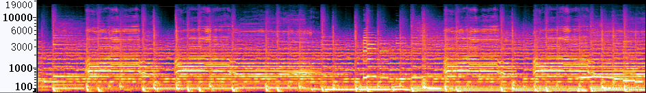</td>
        <td> 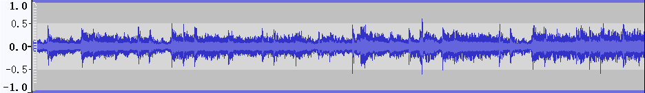</td>
    </tr>
    <tr>
      <td align='middle'> <b>ResUNetDecouple+</b> </td>
        <td> 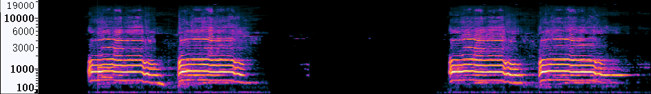</td>
        <td> 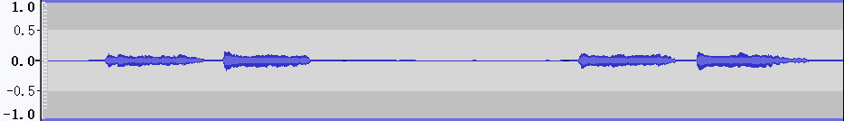</td>
    </tr>
    <tr>
        <td align='center'> <b>VocEmb4Sep (ResUNetDecouple+)</b> </td>
        <td> 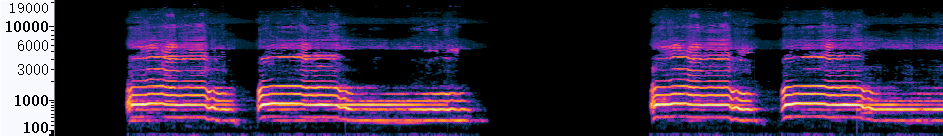</td>
        <td> 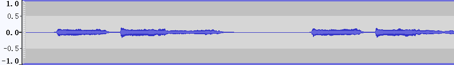</td>
    </tr>
    <tr>
      <td align='center'> <b>HDemucs</b> </td>
        <td> 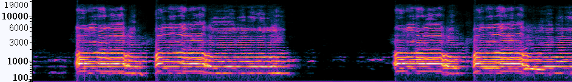</td>
        <td> 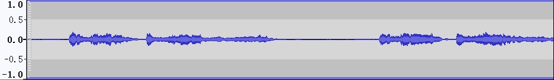</td>
    </tr>
    <tr>
      <td align='center'> <b>VocEmb4Sep (HDemucs)</b></td>
        <td> 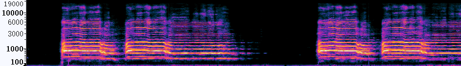</td>
        <td> 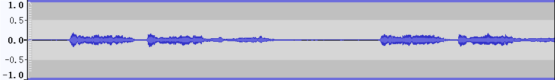</td>
    </tr>
    <tr>
      <td align='center'> <b>Clean</b> </td>
        <td> 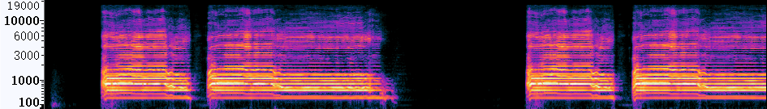</td>
        <td> 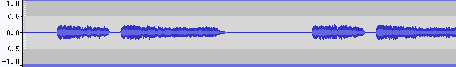</td>
    </tr>
</table>
  
<details align='right'>
  <summary>Expand binaural images</summary>
  
  <table style="margin-left: auto; margin-right: auto; align:center; border: none!important">
    <tr margin-bottom='0px'>
      <td align='center'> <b>Mixture</b> </td>
        <td> 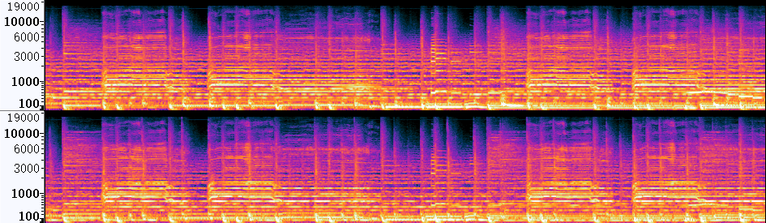</td>
        <td> 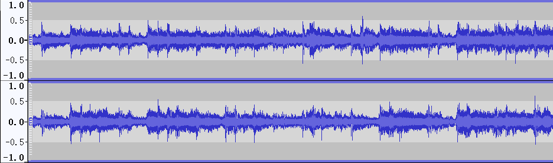</td>
    </tr>
    <tr>
      <td align='center'> <b>ResUNetDecouple+</b> </td>
        <td> 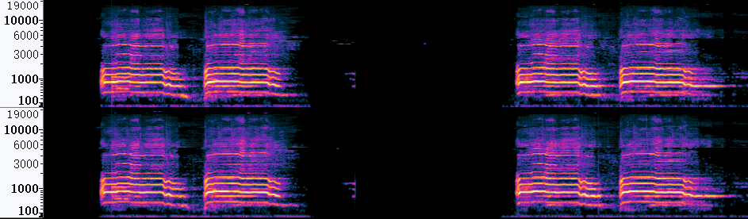</td>
        <td> </td>
    </tr>
    <tr>
      <td align='center'> <b>VocEmb4Sep (ResUNetDecouple+)</b> </td>
        <td> 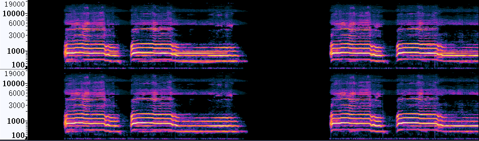</td>
        <td> 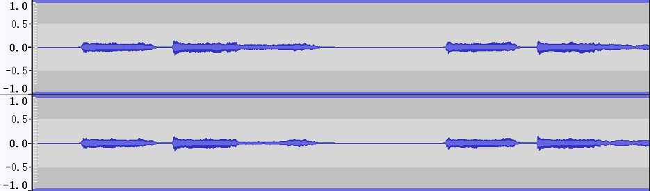</td>
    </tr>
    <tr>
      <td align='center'> <b>HDemucs</b> </td>
        <td> </td>
        <td> 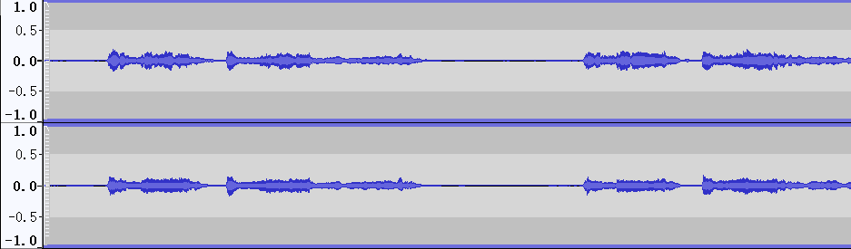</td>
    </tr>
    <tr>
      <td align='center'> <b>VocEmb4Sep (HDemucs)</b></td>
        <td> 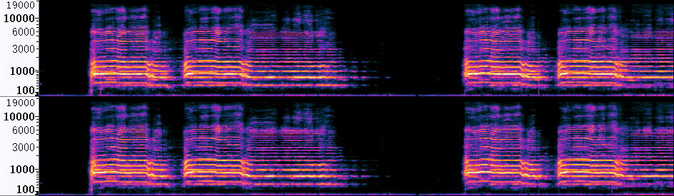</td>
        <td> 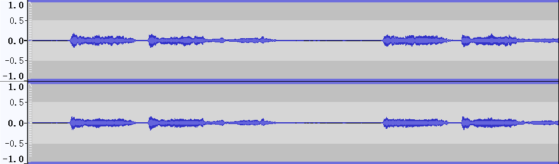</td>
    </tr>
    <tr>
      <td align='center'> <b>Clean</b> </td>
        <td> 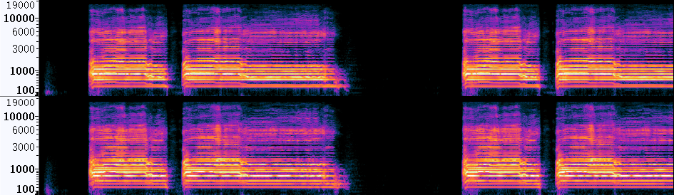</td>
        <td> 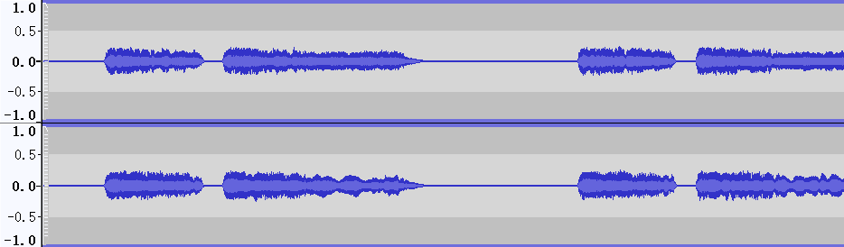</td>
    </tr>
</table>
</details>
<br/>
 
<table style="margin-left: auto; margin-right: auto; align:center; border: none!important; width: 100%">
    <tr>
        <td align='center'>Mixture</td>
        <td align='center'>ResUNetDecouple+</td>
        <td align='center'>VocEmb4Sep (ResUNetDecouple+)</td>
    </tr>
    <tr>
    	<td align='center' width='30%'>
        <audio controls>
            <source src="./data/Mix_Actor_11.wav" type="audio/wav">
            Your browser does not support the audio element.
        </audio>
        </td>
    	<td align='center' width='30%'>
        <audio controls>
            <source src="./data/ResUNet_Actor_11.wav" type="audio/wav">
            Your browser does not support the audio element.
        </audio>
        </td>
    	<td align='center' width='30%'>
        <audio controls>
            <source src="./data/preFro_Actor_11.wav" type="audio/wav">
            Your browser does not support the audio element.
        </audio>
        </td>
    </tr>
    <tr>
    <td align='center'>Clean</td>
    <td align='center'>HDemucs</td>
    <td align='center'>VocEmb4Sep (HDemucs)</td>
    </tr>
    <tr>
        <td align='center' width='30%'>
        <audio controls>
            <source src="./data/clean_Actor_11.wav" type="audio/wav">
            Your browser does not support the audio element.
        </audio>
        </td>
        <td align='center' width='30%'>
        <audio controls>
            <source src="./data/HDemucs_Actor_11.wav" type="audio/wav">
            Your browser does not support the audio element.
        </audio>
        </td>
        <td align='center' width='30%'>
        <audio controls>
            <source src="./data/HDemucsUpd2_Actor_11.wav" type="audio/wav">
            Your browser does not support the audio element.
        </audio>
        </td>
    </tr>
    </table></div>

### Case 2
<div align='center'>
<table style="margin: 0,auto; align:center; vertical-align:middle; border: none!important">
    <tr>
        <td align='center'> <b>Mixture</b> </td>
        <td> 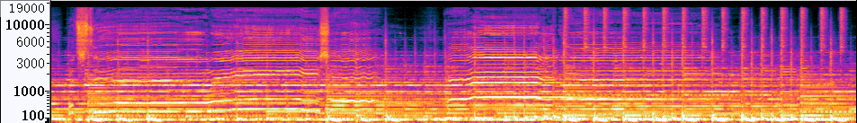</td>
        <td> 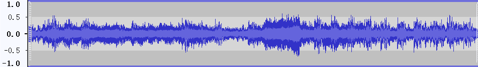</td>
    </tr>
    <tr>
      <td align='middle'> <b>ResUNetDecouple+</b> </td>
        <td> 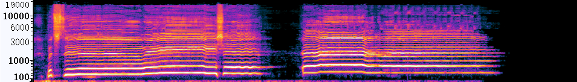</td>
        <td> 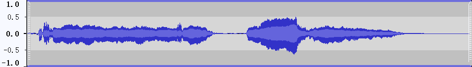</td>
    </tr>
    <tr>
        <td align='center'> <b>VocEmb4Sep (ResUNetDecouple+)</b> </td>
        <td> 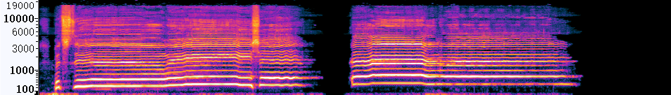</td>
        <td> 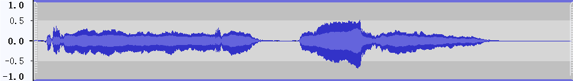</td>
    </tr>
    <tr>
      <td align='center'> <b>HDemucs</b> </td>
        <td> 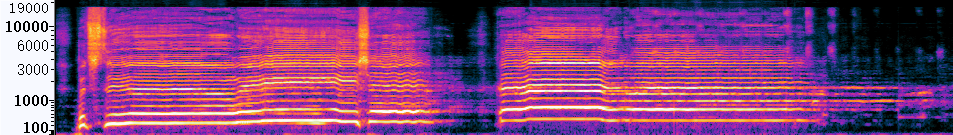</td>
        <td> </td>
    </tr>
    <tr>
      <td align='center'> <b>VocEmb4Sep (HDemucs)</b></td>
        <td> 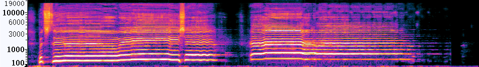</td>
        <td> 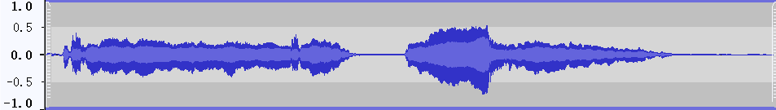</td>
    </tr>
    <tr>
      <td align='center'> <b>Clean</b> </td>
        <td> 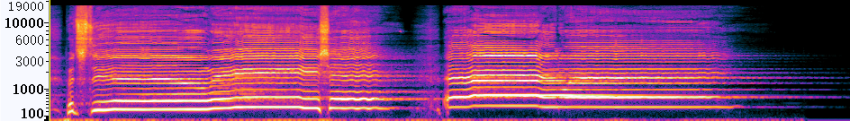</td>
        <td> 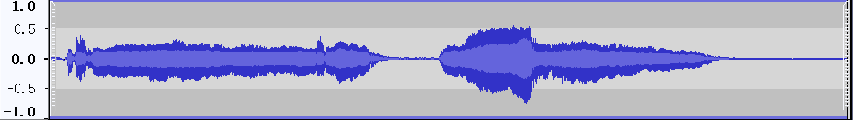</td>
    </tr>
 </table>
  
<details align='right'>
  <summary>Expand binaural images</summary>
  
  <table style="margin-left: auto; margin-right: auto; align:center; border: none!important">
    <tr margin-bottom='0px'>
      <td align='center'> <b>Mixture</b> </td>
        <td> 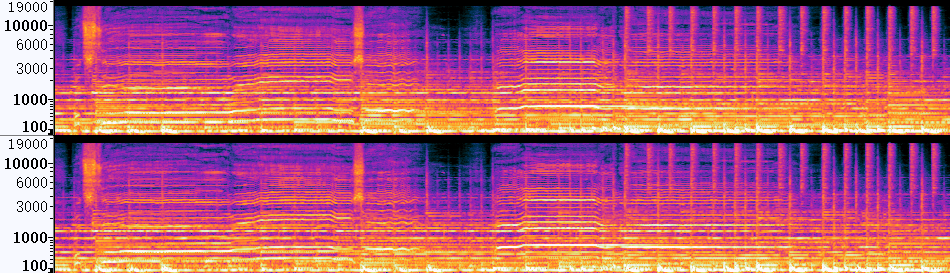</td>
        <td> 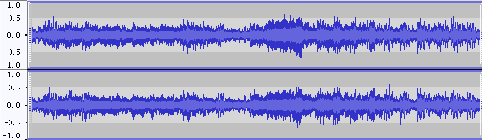</td>
    </tr>
    <tr>
      <td align='center'> <b>ResUNetDecouple+</b> </td>
        <td> 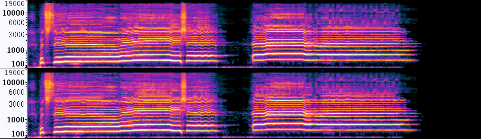</td>
        <td> 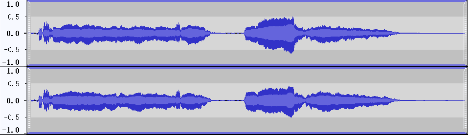</td>
    </tr>
    <tr>
      <td align='center'> <b>VocEmb4Sep (ResUNetDecouple+)</b> </td>
        <td> 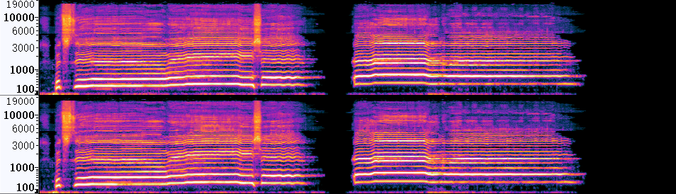</td>
        <td> 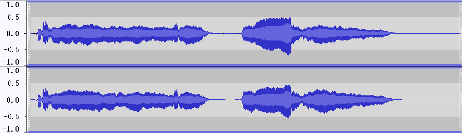</td>
    </tr>
    <tr>
      <td align='center'> <b>HDemucs</b> </td>
        <td> </td>
        <td> 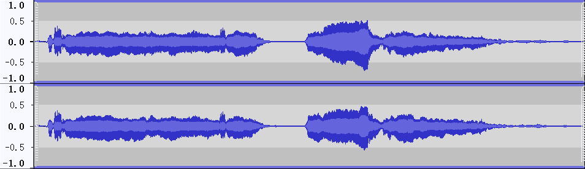</td>
    </tr>
    <tr>
      <td align='center'> <b>VocEmb4Sep (HDemucs)</b></td>
        <td> 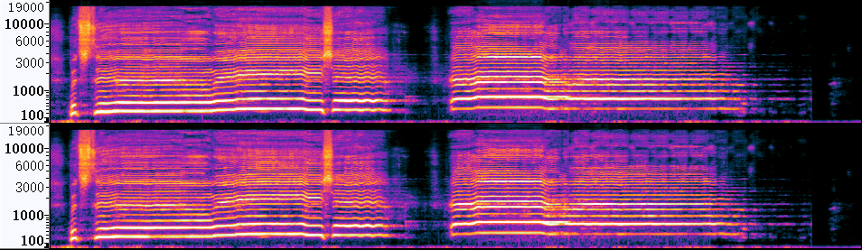</td>
        <td> </td>
    </tr>
    <tr>
      <td align='center'> <b>Clean</b> </td>
        <td> 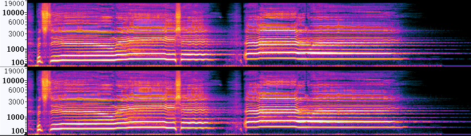</td>
        <td> 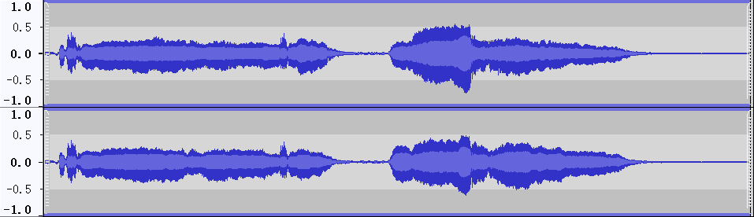</td>
    </tr>
</table>
</details>
<br/>
<table style="margin-left: auto; margin-right: auto; align:center; border: none!important; width: 100%">
    <tr>
        <td align='center'>Mixture</td>
        <td align='center'>ResUNetDecouple+</td>
        <td align='center'>VocEmb4Sep (ResUNetDecouple+)</td>
    </tr>
    <tr>
    	<td align='center' width='30%'>
        <audio controls>
            <source src="./data/Mix_Atrophy_01.wav" type="audio/wav">
            Your browser does not support the audio element.
        </audio>
        </td>
    	<td align='center' width='30%'>
        <audio controls>
            <source src="./data/ResUNet_Atrophy_01.wav" type="audio/wav">
            Your browser does not support the audio element.
        </audio>
        </td>
    	<td align='center' width='30%'>
        <audio controls>
            <source src="./data/preFro_Atrophy_01.wav" type="audio/wav">
            Your browser does not support the audio element.
        </audio>
        </td>
    </tr>
    <tr>
    <td align='center'>Clean</td>
    <td align='center'>HDemucs</td>
    <td align='center'>VocEmb4Sep (HDemucs)</td>
    </tr>
    <tr>
        <td align='center' width='30%'>
        <audio controls>
            <source src="./data/clean_Atrophy_01.wav" type="audio/wav">
            Your browser does not support the audio element.
        </audio>
        </td>
        <td align='center' width='30%'>
        <audio controls>
            <source src="./data/HDemucs_Atrophy_01.wav" type="audio/wav">
            Your browser does not support the audio element.
        </audio>
        </td>
        <td align='center' width='30%'>
        <audio controls>
            <source src="./data/HDemucsUpd2_Atrophy_01.wav" type="audio/wav">
            Your browser does not support the audio element.
        </audio>
        </td>
    </tr>
  </table></div>
  

### Case 3
  <div align='center'>
<table style="margin: 0,auto; align:center; vertical-align:middle; border: none!important">
    <tr>
        <td align='center'> <b>Mixture</b> </td>
        <td> 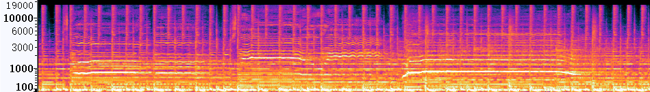</td>
        <td> 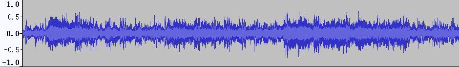</td>
    </tr>
    <tr>
      <td align='middle'> <b>ResUNetDecouple+</b> </td>
        <td> 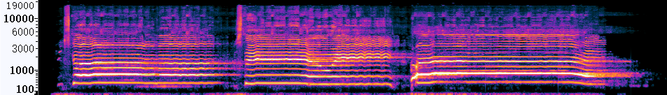</td>
        <td> 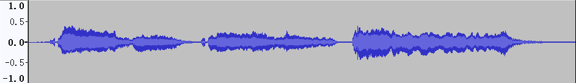</td>
    </tr>
    <tr>
        <td align='center'> <b>VocEmb4Sep (ResUNetDecouple+)</b> </td>
        <td> 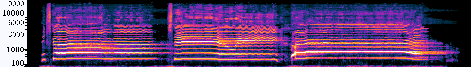</td>
        <td> 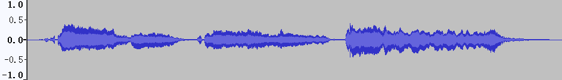</td>
    </tr>
    <tr>
      <td align='center'> <b>HDemucs</b> </td>
        <td> 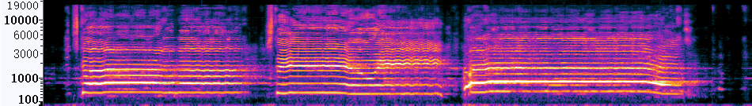</td>
        <td> </td>
    </tr>
    <tr>
      <td align='center'> <b>VocEmb4Sep (HDemucs)</b></td>
        <td> </td>
        <td> </td>
    </tr>
    <tr>
      <td align='center'> <b>Clean</b> </td>
        <td> </td>
        <td> </td>
    </tr>
</table>
  
<details align='right'>
  <summary>Expand binaural images</summary>
  
  <table style="margin-left: auto; margin-right: auto; align:center; border: none!important">
    <tr margin-bottom='0px'>
      <td align='center'> <b>Mixture</b> </td>
        <td> </td>
        <td> </td>
    </tr>
    <tr>
      <td align='center'> <b>ResUNetDecouple+</b> </td>
        <td> </td>
        <td> </td>
    </tr>
    <tr>
      <td align='center'> <b>VocEmb4Sep (ResUNetDecouple+)</b> </td>
        <td> </td>
        <td> </td>
    </tr>
    <tr>
      <td align='center'> <b>HDemucs</b> </td>
        <td> </td>
        <td> </td>
    </tr>
    <tr>
      <td align='center'> <b>VocEmb4Sep (HDemucs)</b></td>
        <td> </td>
        <td> </td>
    </tr>
    <tr>
      <td align='center'> <b>Clean</b> </td>
        <td> </td>
        <td> </td>
    </tr>
</table>
</details>
<br/>
<table style="margin-left: auto; margin-right: auto; align:center; border: none!important; width: 100%">
    <tr>
        <td align='center'>Mixture</td>
        <td align='center'>ResUNetDecouple+</td>
        <td align='center'>VocEmb4Sep (ResUNetDecouple+)</td>
    </tr>
    <tr>
    	<td align='center' width='30%'>
        <audio controls>
            <source src="./data/Mix_Atrophy_03.wav" type="audio/wav">
            Your browser does not support the audio element.
        </audio>
        </td>
    	<td align='center' width='30%'>
        <audio controls>
            <source src="./data/ResUNet_Atrophy_03.wav" type="audio/wav">
            Your browser does not support the audio element.
        </audio>
        </td>
    	<td align='center' width='30%'>
        <audio controls>
            <source src="./data/preFro_Atrophy_03.wav" type="audio/wav">
            Your browser does not support the audio element.
        </audio>
        </td>
    </tr>
    <tr>
    <td align='center'>Clean</td>
    <td align='center'>HDemucs</td>
    <td align='center'>VocEmb4Sep (HDemucs)</td>
    </tr>
    <tr>
        <td align='center' width='30%'>
        <audio controls>
            <source src="./data/clean_Atrophy_03.wav" type="audio/wav">
            Your browser does not support the audio element.
        </audio>
        </td>
        <td align='center' width='30%'>
        <audio controls>
            <source src="./data/HDemucs_Atrophy_03.wav" type="audio/wav">
            Your browser does not support the audio element.
        </audio>
        </td>
        <td align='center' width='30%'>
        <audio controls>
            <source src="./data/HDemucsUpd2_Atrophy_03.wav" type="audio/wav">
            Your browser does not support the audio element.
        </audio>
        </td>
    </tr>
    </table></div>


### Case 4
  <div align='center'>
<table style="margin: 0,auto; align:center; vertical-align:middle; border: none!important">
    <tr>
        <td align='center'> <b>Mixture</b> </td>
        <td> </td>
        <td> </td>
    </tr>
    <tr>
      <td align='middle'> <b>ResUNetDecouple+</b> </td>
        <td> </td>
        <td> </td>
    </tr>
    <tr>
        <td align='center'> <b>VocEmb4Sep (ResUNetDecouple+)</b> </td>
        <td> </td>
        <td> </td>
    </tr>
    <tr>
      <td align='center'> <b>HDemucs</b> </td>
        <td> </td>
        <td> </td>
    </tr>
    <tr>
      <td align='center'> <b>VocEmb4Sep (HDemucs)</b></td>
        <td> </td>
        <td> </td>
    </tr>
    <tr>
      <td align='center'> <b>Clean</b> </td>
        <td> </td>
        <td> </td>
    </tr>
</table>
  
<details align='right'>
  <summary>Expand binaural images</summary>
  
  <table style="margin-left: auto; margin-right: auto; align:center; border: none!important">
    <tr margin-bottom='0px'>
      <td align='center'> <b>Mixture</b> </td>
        <td> </td>
        <td> </td>
    </tr>
    <tr>
      <td align='center'> <b>ResUNetDecouple+</b> </td>
        <td> </td>
        <td> </td>
    </tr>
    <tr>
      <td align='center'> <b>VocEmb4Sep (ResUNetDecouple+)</b> </td>
        <td> </td>
        <td> </td>
    </tr>
    <tr>
      <td align='center'> <b>HDemucs</b> </td>
        <td> </td>
        <td> </td>
    </tr>
    <tr>
      <td align='center'> <b>VocEmb4Sep (HDemucs)</b></td>
        <td> </td>
        <td> </td>
    </tr>
    <tr>
      <td align='center'> <b>Clean</b> </td>
        <td> </td>
        <td> </td>
    </tr>
</table>
</details>
<br/>
<table style="margin-left: auto; margin-right: auto; align:center; border: none!important; width: 100%">
    <tr>
        <td align='center'>Mixture</td>
        <td align='center'>ResUNetDecouple+</td>
        <td align='center'>VocEmb4Sep (ResUNetDecouple+)</td>
    </tr>
    <tr>
    	<td align='center' width='30%'>
        <audio controls>
            <source src="./data/mix_OHNO_04.wav" type="audio/wav">
            Your browser does not support the audio element.
        </audio>
        </td>
    	<td align='center' width='30%'>
        <audio controls>
            <source src="./data/ResUNet_OHNO_04.wav" type="audio/wav">
            Your browser does not support the audio element.
        </audio>
        </td>
    	<td align='center' width='30%'>
        <audio controls>
            <source src="./data/preFro_OHNO_04.wav" type="audio/wav">
            Your browser does not support the audio element.
        </audio>
        </td>
    </tr>
    <tr>
    <td align='center'>Clean</td>
    <td align='center'>HDemucs</td>
    <td align='center'>VocEmb4Sep (HDemucs)</td>
    </tr>
    <tr>
        <td align='center' width='30%'>
        <audio controls>
            <source src="./data/clean_OHNO_04.wav" type="audio/wav">
            Your browser does not support the audio element.
        </audio>
        </td>
        <td align='center' width='30%'>
        <audio controls>
            <source src="./data/HDemucs_OHNO_04.wav" type="audio/wav">
            Your browser does not support the audio element.
        </audio>
        </td>
        <td align='center' width='30%'>
        <audio controls>
            <source src="./data/HDemucsUpd_OHNO_04.wav" type="audio/wav">
            Your browser does not support the audio element.
        </audio>
        </td>
    </tr>
    </table></div>
  
  
### Case 5
  <div align='center'>
<table style="margin: 0,auto; align:center; vertical-align:middle; border: none!important">
    <tr>
        <td align='center'> <b>Mixture</b> </td>
        <td> </td>
        <td> </td>
    </tr>
    <tr>
      <td align='middle'> <b>ResUNetDecouple+</b> </td>
        <td> </td>
        <td> </td>
    </tr>
    <tr>
        <td align='center'> <b>VocEmb4Sep (ResUNetDecouple+)</b> </td>
        <td> </td>
        <td> </td>
    </tr>
    <tr>
      <td align='center'> <b>HDemucs</b> </td>
        <td> </td>
        <td> </td>
    </tr>
    <tr>
      <td align='center'> <b>VocEmb4Sep (HDemucs)</b></td>
        <td> </td>
        <td> </td>
    </tr>
    <tr>
      <td align='center'> <b>Clean</b> </td>
        <td> </td>
        <td> </td>
    </tr>
</table>
  
<details align='right'>
  <summary>Expand binaural images</summary>
  
  <table style="margin-left: auto; margin-right: auto; align:center; border: none!important">
    <tr margin-bottom='0px'>
      <td align='center'> <b>Mixture</b> </td>
        <td> </td>
        <td> </td>
    </tr>
    <tr>
      <td align='center'> <b>ResUNetDecouple+</b> </td>
        <td> </td>
        <td> </td>
    </tr>
    <tr>
      <td align='center'> <b>VocEmb4Sep (ResUNetDecouple+)</b> </td>
        <td> </td>
        <td> </td>
    </tr>
    <tr>
      <td align='center'> <b>HDemucs</b> </td>
        <td> </td>
        <td> </td>
    </tr>
    <tr>
      <td align='center'> <b>VocEmb4Sep (HDemucs)</b></td>
        <td> </td>
        <td> </td>
    </tr>
    <tr>
      <td align='center'> <b>Clean</b> </td>
        <td> </td>
        <td> </td>
    </tr>
</table>
</details>
<br/>
<table style="margin-left: auto; margin-right: auto; align:center; border: none!important; width: 100%">
    <tr>
        <td align='center'>Mixture</td>
        <td align='center'>ResUNetDecouple+</td>
        <td align='center'>VocEmb4Sep (ResUNetDecouple+)</td>
    </tr>
    <tr>
    	<td align='center' width='30%'>
        <audio controls>
            <source src="./data/mix_Moos_05.wav" type="audio/wav">
            Your browser does not support the audio element.
        </audio>
        </td>
    	<td align='center' width='30%'>
        <audio controls>
            <source src="./data/ResUNet_Moos_05.wav" type="audio/wav">
            Your browser does not support the audio element.
        </audio>
        </td>
    	<td align='center' width='30%'>
        <audio controls>
            <source src="./data/preFro_Moos_05.wav" type="audio/wav">
            Your browser does not support the audio element.
        </audio>
        </td>
    </tr>
    <tr>
    <td align='center'>Clean</td>
    <td align='center'>HDemucs</td>
    <td align='center'>VocEmb4Sep (HDemucs)</td>
    </tr>
    <tr>
        <td align='center' width='30%'>
        <audio controls>
            <source src="./data/clean_Moos_05.wav" type="audio/wav">
            Your browser does not support the audio element.
        </audio>
        </td>
        <td align='center' width='30%'>
        <audio controls>
            <source src="./data/HDemucs_Moos_05.wav" type="audio/wav">
            Your browser does not support the audio element.
        </audio>
        </td>
        <td align='center' width='30%'>
        <audio controls>
            <source src="./data/HDemucsUpd_Moos_05.wav" type="audio/wav">
            Your browser does not support the audio element.
        </audio>
        </td>
    </tr>
    </table></div>
 
 
### Case 6
  <div align='center'>
<table style="margin: 0,auto; align:center; vertical-align:middle; border: none!important">
    <tr>
        <td align='center'> <b>Mixture</b> </td>
        <td> </td>
        <td> </td>
    </tr>
    <tr>
      <td align='middle'> <b>ResUNetDecouple+</b> </td>
        <td> </td>
        <td> </td>
    </tr>
    <tr>
        <td align='center'> <b>VocEmb4Sep (ResUNetDecouple+)</b> </td>
        <td> </td>
        <td> </td>
    </tr>
    <tr>
      <td align='center'> <b>HDemucs</b> </td>
        <td> </td>
        <td> </td>
    </tr>
    <tr>
      <td align='center'> <b>VocEmb4Sep (HDemucs)</b></td>
        <td> </td>
        <td> </td>
    </tr>
    <tr>
      <td align='center'> <b>Clean</b> </td>
        <td> </td>
        <td> </td>
    </tr>
</table>
  
<details align='right'>
  <summary>Expand binaural images</summary>
  
  <table style="margin-left: auto; margin-right: auto; align:center; border: none!important">
    <tr margin-bottom='0px'>
      <td align='center'> <b>Mixture</b> </td>
        <td> </td>
        <td> </td>
    </tr>
    <tr>
      <td align='center'> <b>ResUNetDecouple+</b> </td>
        <td> </td>
        <td> </td>
    </tr>
    <tr>
      <td align='center'> <b>VocEmb4Sep (ResUNetDecouple+)</b> </td>
        <td> </td>
        <td> </td>
    </tr>
    <tr>
      <td align='center'> <b>HDemucs</b> </td>
        <td> </td>
        <td> </td>
    </tr>
    <tr>
      <td align='center'> <b>VocEmb4Sep (HDemucs)</b></td>
        <td> </td>
        <td> </td>
    </tr>
    <tr>
      <td align='center'> <b>Clean</b> </td>
        <td> </td>
        <td> </td>
    </tr>
</table>
</details>
<br/>
 
<table style="margin-left: auto; margin-right: auto; align:center; border: none!important; width: 100%">
    <tr>
        <td align='center'>Mixture</td>
        <td align='center'>ResUNetDecouple+</td>
        <td align='center'>VocEmb4Sep (ResUNetDecouple+)</td>
    </tr>
    <tr>
    	<td align='center' width='30%'>
        <audio controls>
            <source src="./data/Mix_Bulldozer_06.wav" type="audio/wav">
            Your browser does not support the audio element.
        </audio>
        </td>
    	<td align='center' width='30%'>
        <audio controls>
            <source src="./data/ResUNet_Bulldozer_06.wav" type="audio/wav">
            Your browser does not support the audio element.
        </audio>
        </td>
    	<td align='center' width='30%'>
        <audio controls>
            <source src="./data/preFro_Bulldozer_06.wav" type="audio/wav">
            Your browser does not support the audio element.
        </audio>
        </td>
    </tr>
    <tr>
    <td align='center'>Clean</td>
    <td align='center'>HDemucs</td>
    <td align='center'>VocEmb4Sep (HDemucs)</td>
    </tr>
    <tr>
        <td align='center' width='30%'>
        <audio controls>
            <source src="./data/clean_Bulldozer_06.wav" type="audio/wav">
            Your browser does not support the audio element.
        </audio>
        </td>
        <td align='center' width='30%'>
        <audio controls>
            <source src="./data/HDemucs_Bulldozer_06.wav" type="audio/wav">
            Your browser does not support the audio element.
        </audio>
        </td>
        <td align='center' width='30%'>
        <audio controls>
            <source src="./data/HDemucsUpd2_Bulldozer_06.wav" type="audio/wav">
            Your browser does not support the audio element.
        </audio>
        </td>
    </tr>
    </table></div>


### Case 7
  <div align='center'>
<table style="margin: 0,auto; align:center; vertical-align:middle; border: none!important">
    <tr>
        <td align='center'> <b>Mixture</b> </td>
        <td> </td>
        <td> </td>
    </tr>
    <tr>
      <td align='middle'> <b>ResUNetDecouple+</b> </td>
        <td> </td>
        <td> </td>
    </tr>
    <tr>
        <td align='center'> <b>VocEmb4Sep (ResUNetDecouple+)</b> </td>
        <td> </td>
        <td> </td>
    </tr>
    <tr>
      <td align='center'> <b>HDemucs</b> </td>
        <td> </td>
        <td> </td>
    </tr>
    <tr>
      <td align='center'> <b>VocEmb4Sep (HDemucs)</b></td>
        <td> </td>
        <td> </td>
    </tr>
    <tr>
      <td align='center'> <b>Clean</b> </td>
        <td> </td>
        <td> </td>
    </tr>
</table>
  
<details align='right'>
  <summary>Expand binaural images</summary>
  
  <table style="margin-left: auto; margin-right: auto; align:center; border: none!important">
    <tr margin-bottom='0px'>
      <td align='center'> <b>Mixture</b> </td>
        <td> </td>
        <td> </td>
    </tr>
    <tr>
      <td align='center'> <b>ResUNetDecouple+</b> </td>
        <td> </td>
        <td> </td>
    </tr>
    <tr>
      <td align='center'> <b>VocEmb4Sep (ResUNetDecouple+)</b> </td>
        <td> </td>
        <td> </td>
    </tr>
    <tr>
      <td align='center'> <b>HDemucs</b> </td>
        <td> </td>
        <td> </td>
    </tr>
    <tr>
      <td align='center'> <b>VocEmb4Sep (HDemucs)</b></td>
        <td> </td>
        <td> </td>
    </tr>
    <tr>
      <td align='center'> <b>Clean</b> </td>
        <td> </td>
        <td> </td>
    </tr>
</table>
</details>
<br/>
 
<table style="margin-left: auto; margin-right: auto; align:center; border: none!important; width: 100%">
    <tr>
        <td align='center'>Mixture</td>
        <td align='center'>ResUNetDecouple+</td>
        <td align='center'>VocEmb4Sep (ResUNetDecouple+)</td>
    </tr>
    <tr>
    	<td align='center' width='30%'>
        <audio controls>
            <source src="./wav/Mix_Bulldozer_07.wav" type="audio/wav">
            Your browser does not support the audio element.
        </audio>
        </td>
    	<td align='center' width='30%'>
        <audio controls>
            <source src="./wav/ResUNet_Bulldozer_07.wav" type="audio/wav">
            Your browser does not support the audio element.
        </audio>
        </td>
    	<td align='center' width='30%'>
        <audio controls>
            <source src="./wav/preFro_Bulldozer_07.wav" type="audio/wav">
            Your browser does not support the audio element.
        </audio>
        </td>
    </tr>
    <tr>
    <td align='center'>Clean</td>
    <td align='center'>HDemucs</td>
    <td align='center'>VocEmb4Sep (HDemucs)</td>
    </tr>
    <tr>
        <td align='center' width='30%'>
        <audio controls>
            <source src="./wav/clean_Bulldozer_07.wav" type="audio/wav">
            Your browser does not support the audio element.
        </audio>
        </td>
        <td align='center' width='30%'>
        <audio controls>
            <source src="./wav/HDemucs_Bulldozer_07.wav" type="audio/wav">
            Your browser does not support the audio element.
        </audio>
        </td>
        <td align='center' width='30%'>
        <audio controls>
            <source src="./wav/HDemucsUpd2_Bulldozer_07.wav" type="audio/wav">
            Your browser does not support the audio element.
        </audio>
        </td>
    </tr>
    </table></div>
    

### Case 8
  <div align='center'>
<table style="margin: 0,auto; align:center; vertical-align:middle; border: none!important">
    <tr>
        <td align='center'> <b>Mixture</b> </td>
        <td> </td>
        <td> </td>
    </tr>
    <tr>
      <td align='middle'> <b>ResUNetDecouple+</b> </td>
        <td> </td>
        <td> </td>
    </tr>
    <tr>
        <td align='center'> <b>VocEmb4Sep (ResUNetDecouple+)</b> </td>
        <td> </td>
        <td> </td>
    </tr>
    <tr>
      <td align='center'> <b>HDemucs</b> </td>
        <td> </td>
        <td> </td>
    </tr>
    <tr>
      <td align='center'> <b>VocEmb4Sep (HDemucs)</b></td>
        <td> </td>
        <td> </td>
    </tr>
    <tr>
      <td align='center'> <b>Clean</b> </td>
        <td> </td>
        <td> </td>
    </tr>
</table>
  
<details align='right'>
  <summary>Expand binaural images</summary>
  
  <table style="margin-left: auto; margin-right: auto; align:center; border: none!important">
    <tr margin-bottom='0px'>
      <td align='center'> <b>Mixture</b> </td>
        <td> </td>
        <td> </td>
    </tr>
    <tr>
      <td align='center'> <b>ResUNetDecouple+</b> </td>
        <td> </td>
        <td> </td>
    </tr>
    <tr>
      <td align='center'> <b>VocEmb4Sep (ResUNetDecouple+)</b> </td>
        <td> </td>
        <td> </td>
    </tr>
    <tr>
      <td align='center'> <b>HDemucs</b> </td>
        <td> </td>
        <td> </td>
    </tr>
    <tr>
      <td align='center'> <b>VocEmb4Sep (HDemucs)</b></td>
        <td> </td>
        <td> </td>
    </tr>
    <tr>
      <td align='center'> <b>Clean</b> </td>
        <td> </td>
        <td> </td>
    </tr>
</table>
</details>
<br/>
 
<table style="margin-left: auto; margin-right: auto; align:center; border: none!important; width: 100%">
    <tr>
        <td align='center'>Mixture</td>
        <td align='center'>ResUNetDecouple+</td>
        <td align='center'>VocEmb4Sep (ResUNetDecouple+)</td>
    </tr>
    <tr>
    	<td align='center' width='30%'>
        <audio controls>
            <source src="./data/Mix_Shore_08.wav" type="audio/wav">
            Your browser does not support the audio element.
        </audio>
        </td>
    	<td align='center' width='30%'>
        <audio controls>
            <source src="./data/ResUNet_Shore_08.wav" type="audio/wav">
            Your browser does not support the audio element.
        </audio>
        </td>
    	<td align='center' width='30%'>
        <audio controls>
            <source src="./data/preFro_Shore_08.wav" type="audio/wav">
            Your browser does not support the audio element.
        </audio>
        </td>
    </tr>
    <tr>
    <td align='center'>Clean</td>
    <td align='center'>HDemucs</td>
    <td align='center'>VocEmb4Sep (HDemucs)</td>
    </tr>
    <tr>
        <td align='center' width='30%'>
        <audio controls>
            <source src="./data/clean_Shore_08.wav" type="audio/wav">
            Your browser does not support the audio element.
        </audio>
        </td>
        <td align='center' width='30%'>
        <audio controls>
            <source src="./data/HDemucs_Shore_08.wav" type="audio/wav">
            Your browser does not support the audio element.
        </audio>
        </td>
        <td align='center' width='30%'>
        <audio controls>
            <source src="./data/HDemucsUpd2_Shore_08.wav" type="audio/wav">
            Your browser does not support the audio element.
        </audio>
        </td>
    </tr>
    </table></div>
    

### Case 9
  <div align='center'>
<table style="margin: 0,auto; align:center; vertical-align:middle; border: none!important">
    <tr>
        <td align='center'> <b>Mixture</b> </td>
        <td> </td>
        <td> </td>
    </tr>
    <tr>
      <td align='middle'> <b>ResUNetDecouple+</b> </td>
        <td> </td>
        <td> </td>
    </tr>
    <tr>
        <td align='center'> <b>VocEmb4Sep (ResUNetDecouple+)</b> </td>
        <td> </td>
        <td> </td>
    </tr>
    <tr>
      <td align='center'> <b>HDemucs</b> </td>
        <td> </td>
        <td> </td>
    </tr>
    <tr>
      <td align='center'> <b>VocEmb4Sep (HDemucs)</b></td>
        <td> </td>
        <td> </td>
    </tr>
    <tr>
      <td align='center'> <b>Clean</b> </td>
        <td> </td>
        <td> </td>
    </tr>
</table>
  
<details align='right'>
  <summary>Expand binaural images</summary>
  
  <table style="margin-left: auto; margin-right: auto; align:center; border: none!important">
    <tr margin-bottom='0px'>
      <td align='center'> <b>Mixture</b> </td>
        <td> </td>
        <td> </td>
    </tr>
    <tr>
      <td align='center'> <b>ResUNetDecouple+</b> </td>
        <td> </td>
        <td> </td>
    </tr>
    <tr>
      <td align='center'> <b>VocEmb4Sep (ResUNetDecouple+)</b> </td>
        <td> </td>
        <td> </td>
    </tr>
    <tr>
      <td align='center'> <b>HDemucs</b> </td>
        <td> </td>
        <td> </td>
    </tr>
    <tr>
      <td align='center'> <b>VocEmb4Sep (HDemucs)</b></td>
        <td> </td>
        <td> </td>
    </tr>
    <tr>
      <td align='center'> <b>Clean</b> </td>
        <td> </td>
        <td> </td>
    </tr>
</table>
</details>
<br/>
 
<table style="margin-left: auto; margin-right: auto; align:center; border: none!important; width: 100%">
    <tr>
        <td align='center'>Mixture</td>
        <td align='center'>ResUNetDecouple+</td>
        <td align='center'>VocEmb4Sep (ResUNetDecouple+)</td>
    </tr>
    <tr>
    	<td align='center' width='30%'>
        <audio controls>
            <source src="./data/Mix_Shore_09.wav" type="audio/wav">
            Your browser does not support the audio element.
        </audio>
        </td>
    	<td align='center' width='30%'>
        <audio controls>
            <source src="./data/ResUNet_Shore_09.wav" type="audio/wav">
            Your browser does not support the audio element.
        </audio>
        </td>
    	<td align='center' width='30%'>
        <audio controls>
            <source src="./data/preFro_Shore_09.wav" type="audio/wav">
            Your browser does not support the audio element.
        </audio>
        </td>
    </tr>
    <tr>
    <td align='center'>Clean</td>
    <td align='center'>HDemucs</td>
    <td align='center'>VocEmb4Sep (HDemucs)</td>
    </tr>
    <tr>
        <td align='center' width='30%'>
        <audio controls>
            <source src="./data/clean_Shore_09.wav" type="audio/wav">
            Your browser does not support the audio element.
        </audio>
        </td>
        <td align='center' width='30%'>
        <audio controls>
            <source src="./data/HDemucs_Shore_09.wav" type="audio/wav">
            Your browser does not support the audio element.
        </audio>
        </td>
        <td align='center' width='30%'>
        <audio controls>
            <source src="./data/HDemucsUpd2_Shore_09.wav" type="audio/wav">
            Your browser does not support the audio element.
        </audio>
        </td>
    </tr>
    </table></div>
    

### Case 10
  <div align='center'>
<table style="margin: 0,auto; align:center; vertical-align:middle; border: none!important">
    <tr>
        <td align='center'> <b>Mixture</b> </td>
        <td> </td>
        <td> </td>
    </tr>
    <tr>
      <td align='middle'> <b>ResUNetDecouple+</b> </td>
        <td> </td>
        <td> </td>
    </tr>
    <tr>
        <td align='center'> <b>VocEmb4Sep (ResUNetDecouple+)</b> </td>
        <td> </td>
        <td> </td>
    </tr>
    <tr>
      <td align='center'> <b>HDemucs</b> </td>
        <td> </td>
        <td> </td>
    </tr>
    <tr>
      <td align='center'> <b>VocEmb4Sep (HDemucs)</b></td>
        <td> </td>
        <td> </td>
    </tr>
    <tr>
      <td align='center'> <b>Clean</b> </td>
        <td> </td>
        <td> </td>
    </tr>
</table>
  
<details align='right'>
  <summary>Expand binaural images</summary>
  
  <table style="margin-left: auto; margin-right: auto; align:center; border: none!important">
    <tr margin-bottom='0px'>
      <td align='center'> <b>Mixture</b> </td>
        <td> </td>
        <td> </td>
    </tr>
    <tr>
      <td align='center'> <b>ResUNetDecouple+</b> </td>
        <td> </td>
        <td> </td>
    </tr>
    <tr>
      <td align='center'> <b>VocEmb4Sep (ResUNetDecouple+)</b> </td>
        <td> </td>
        <td> </td>
    </tr>
    <tr>
      <td align='center'> <b>HDemucs</b> </td>
        <td> </td>
        <td> </td>
    </tr>
    <tr>
      <td align='center'> <b>VocEmb4Sep (HDemucs)</b></td>
        <td> </td>
        <td> </td>
    </tr>
    <tr>
      <td align='center'> <b>Clean</b> </td>
        <td> </td>
        <td> </td>
    </tr>
</table>
</details>
<br/>
 
<table style="margin-left: auto; margin-right: auto; align:center; border: none!important; width: 100%">
    <tr>
        <td align='center'>Mixture</td>
        <td align='center'>ResUNetDecouple+</td>
        <td align='center'>VocEmb4Sep (ResUNetDecouple+)</td>
    </tr>
    <tr>
    	<td align='center' width='30%'>
        <audio controls>
            <source src="./data/Mix_Finest_10.wav" type="audio/wav">
            Your browser does not support the audio element.
        </audio>
        </td>
    	<td align='center' width='30%'>
        <audio controls>
            <source src="./data/ResUNet_Finest_10.wav" type="audio/wav">
            Your browser does not support the audio element.
        </audio>
        </td>
    	<td align='center' width='30%'>
        <audio controls>
            <source src="./data/preFro_Finest_10.wav" type="audio/wav">
            Your browser does not support the audio element.
        </audio>
        </td>
    </tr>
    <tr>
    <td align='center'>Clean</td>
    <td align='center'>HDemucs</td>
    <td align='center'>VocEmb4Sep (HDemucs)</td>
    </tr>
    <tr>
        <td align='center' width='30%'>
        <audio controls>
            <source src="./data/clean_Finest_10.wav" type="audio/wav">
            Your browser does not support the audio element.
        </audio>
        </td>
        <td align='center' width='30%'>
        <audio controls>
            <source src="./data/HDemucs_Finest_10.wav" type="audio/wav">
            Your browser does not support the audio element.
        </audio>
        </td>
        <td align='center' width='30%'>
        <audio controls>
            <source src="./data/HDemucsUpd2_Finest_10.wav" type="audio/wav">
            Your browser does not support the audio element.
        </audio>
        </td>
    </tr>
    </table></div>
   
    

### Case 11
<div align='center'>
<table style="margin: 0,auto; align:center; vertical-align:middle; border: none!important">
    <tr>
        <td align='center'> <b>Mixture</b> </td>
        <td> </td>
        <td> </td>
    </tr>
    <tr>
      <td align='middle'> <b>ResUNetDecouple+</b> </td>
        <td> </td>
        <td> </td>
    </tr>
    <tr>
        <td align='center'> <b>VocEmb4Sep (ResUNetDecouple+)</b> </td>
        <td> </td>
        <td> </td>
    </tr>
    <tr>
      <td align='center'> <b>HDemucs</b> </td>
        <td> </td>
        <td> </td>
    </tr>
    <tr>
      <td align='center'> <b>VocEmb4Sep (HDemucs)</b></td>
        <td> </td>
        <td> </td>
    </tr>
    <tr>
      <td align='center'> <b>Clean</b> </td>
        <td> </td>
        <td> </td>
    </tr>
 </table>
  
<details align='right'>
  <summary>Expand binaural images</summary>
  
  <table style="margin-left: auto; margin-right: auto; align:center; border: none!important">
    <tr margin-bottom='0px'>
      <td align='center'> <b>Mixture</b> </td>
        <td> </td>
        <td> </td>
    </tr>
    <tr>
      <td align='center'> <b>ResUNetDecouple+</b> </td>
        <td> </td>
        <td> </td>
    </tr>
    <tr>
      <td align='center'> <b>VocEmb4Sep (ResUNetDecouple+)</b> </td>
        <td> </td>
        <td> </td>
    </tr>
    <tr>
      <td align='center'> <b>HDemucs</b> </td>
        <td> </td>
        <td> </td>
    </tr>
    <tr>
      <td align='center'> <b>VocEmb4Sep (HDemucs)</b></td>
        <td> </td>
        <td> </td>
    </tr>
    <tr>
      <td align='center'> <b>Clean</b> </td>
        <td> </td>
        <td> </td>
    </tr>
</table>
</details>
<br/>
<table style="margin-left: auto; margin-right: auto; align:center; border: none!important; width: 100%">
    <tr>
        <td align='center'>Mixture</td>
        <td align='center'>ResUNetDecouple+</td>
        <td align='center'>VocEmb4Sep (ResUNetDecouple+)</td>
    </tr>
    <tr>
    	<td align='center' width='30%'>
        <audio controls>
            <source src="./data/mix_Angels_02.wav" type="audio/wav">
            Your browser does not support the audio element.
        </audio>
        </td>
    	<td align='center' width='30%'>
        <audio controls>
            <source src="./data/ResUNet_Angels_02.wav" type="audio/wav">
            Your browser does not support the audio element.
        </audio>
        </td>
    	<td align='center' width='30%'>
        <audio controls>
            <source src="./data/preFro_Angels_02.wav" type="audio/wav">
            Your browser does not support the audio element.
        </audio>
        </td>
    </tr>
    <tr>
    <td align='center'>Clean</td>
    <td align='center'>HDemucs</td>
    <td align='center'>VocEmb4Sep (HDemucs)</td>
    </tr>
    <tr>        
        <td align='center' width='30%'>
        <audio controls>
            <source src="./data/clean_Angels_02.wav" type="audio/wav">
            Your browser does not support the audio element.
        </audio>
        </td>
        <td align='center' width='30%'>
        <audio controls>
            <source src="./data/HDemucs_Angels_02.wav" type="audio/wav">
            Your browser does not support the audio element.
        </audio>
        </td>
        <td align='center' width='30%'>
        <audio controls>
            <source src="./data/HDemucsUpd_Angels_02.wav" type="audio/wav">
            Your browser does not support the audio element.
        </audio>
        </td>
    </tr>
  </table></div>  
    
<!-- </html> 

### Small image


### Large image


### Definition lists can be used with HTML syntax.

<dl>
<dt>Name</dt>
<dd>Godzilla</dd>
<dt>Born</dt>
<dd>1952</dd>
<dt>Birthplace</dt>
<dd>Japan</dd>
<dt>Color</dt>
<dd>Green</dd>
</dl>

```
Long, single-line code blocks should not wrap. They should horizontally scroll if they are too long. This line should be long enough to demonstrate this.
```

```
The final element.
```
 -->
