Text can be **bold**, _italic_, or ~~strikethrough~~.

[Link to another page](./another-page.html).

There should be whitespace between paragraphs.

There should be whitespace between paragraphs. We recommend including a README, or a file with information about your project.

<details>
<summary><mark>Please click here!</mark></summary>
Hi   Welcome to hiden space!
  
  
### Mixture
<div align='center'>
  <audio controls>
    <source src="./wav/Mix_Atrophy_01.wav" type="audio/wav">
  Your browser does not support the audio element.
  </audio>
</div>

<div align='center'>
  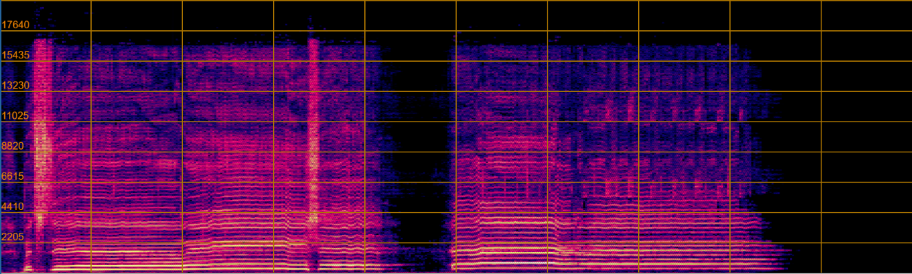
  
  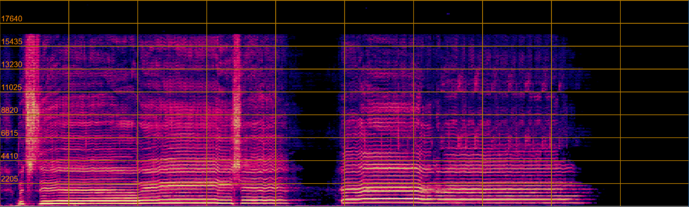
  
 </div>

</details>

# Audio demo
This is the audio demo part.

## Case 1
<div align='center'>
<table style="margin-left: auto; margin-right: auto; align:center; border: none!important">
    <tr>
    <td>Mixture</td>
        <td> 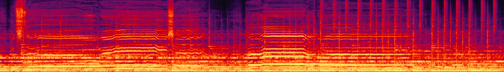</td>
        <td> 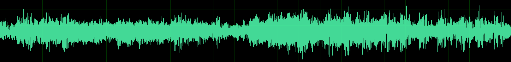</td>
    </tr>
    <tr>
    <td>ResUNetDecouple+</td>
        <td> 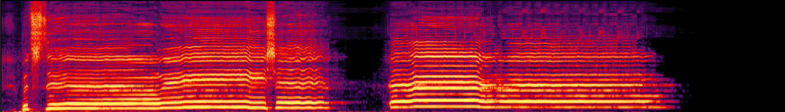</td>
        <td> </td>
    </tr>
    <tr>
    <td>VocEmb4Sep (ResUNetDecouple+)</td>
        <td> 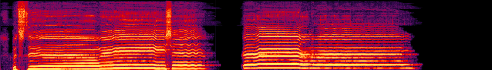</td>
        <td> 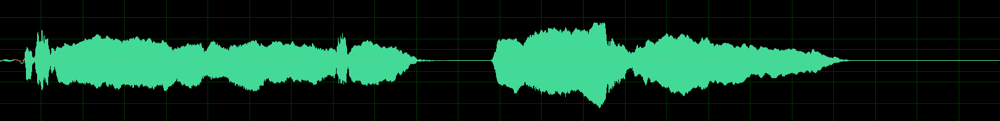</td>
    </tr>
    <tr>
    <td>HDemucs</td>
        <td> 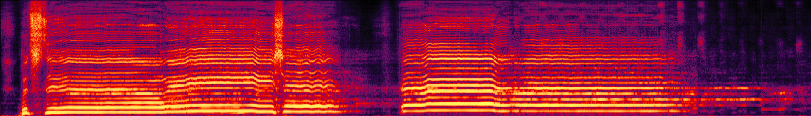</td>
        <td> 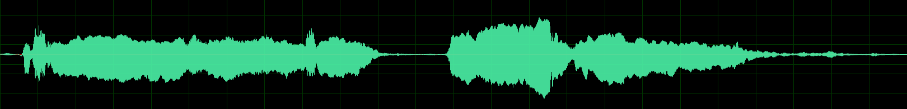</td>
    </tr>
    <tr>
    <td>VocEmb4Sep (HDemucs)</td>
        <td> 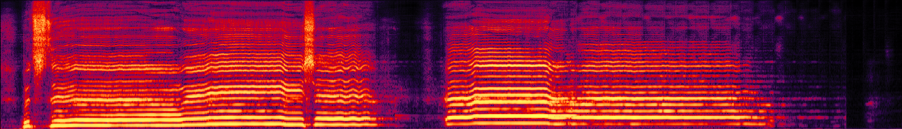</td>
        <td> 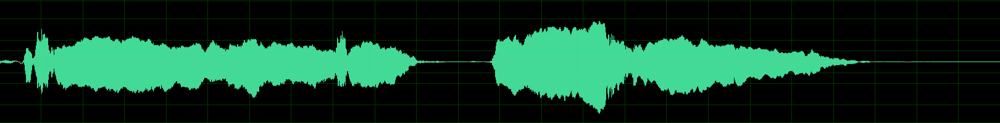</td>
    </tr>
    <tr>
    <td>Clean</td>
        <td> 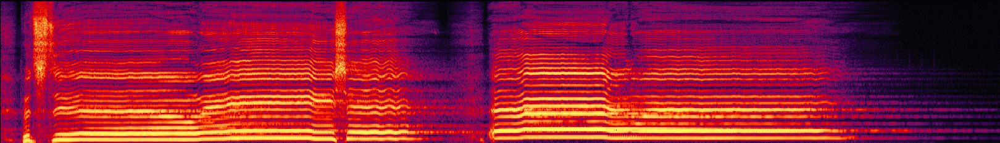</td>
        <td> 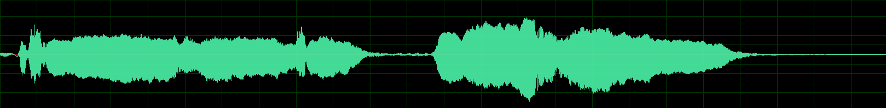</td>
    </tr>
</table>

<table style="margin-left: auto; margin-right: auto; align:center; border: none!important">
    <tr>
        <td align='center'>Mixture</td>
        <td align='center'>ResUNetDecouple+</td>
        <td align='center'>VocEmb4Sep (ResUNetDecouple+)</td>
    </tr>
    <tr width='100%'>
    	<td align='center' width='30%'>
        <audio controls>
            <source src="./wav/Mix_Atrophy_01.wav" type="audio/wav">
            Your browser does not support the audio element.
        </audio>
        </td>
    	<td align='center' width='30%'>
        <audio controls>
            <source src="./wav/ResUNet_Atrophy_01.wav" type="audio/wav">
            Your browser does not support the audio element.
        </audio>
        </td>
    	<td align='center' width='30%'>
        <audio controls>
            <source src="./wav/preFro_Atrophy_01.wav" type="audio/wav">
            Your browser does not support the audio element.
        </audio>
        </td>
    </tr>
    <tr>
    <td align='center'>HDemucs</td>
    <td align='center'>VocEmb4Sep (HDemucs)</td>
    <td align='center'>Clean</td>
    </tr>
    <tr width='100%'>
        <td align='center' width='30%'>
        <audio controls>
            <source src="./wav/HDemucs_Atrophy_01.wav" type="audio/wav">
            Your browser does not support the audio element.
        </audio>
        </td>
        <td align='center' width='30%'>
        <audio controls>
            <source src="./wav/HDemucsUpd2_Atrophy_01.wav" type="audio/wav">
            Your browser does not support the audio element.
        </audio>
        </td>
        <td align='center' width='30%'>
        <audio controls>
            <source src="./wav/clean_Atrophy_01.wav" type="audio/wav">
            Your browser does not support the audio element.
        </audio>
        </td>
    </tr>
</table>
</div>

### ResUNet
<html>
<style>
  th, tr, td {border: none!important;}
</style> 
  <table style="margin-left: auto; margin-right: auto; align:center; border: none!important">
  <th colspan=2> Case 1 </th>
        <tr>
            <td align='center'>
              <b> Mixture </b>
            </td>
            <td align='center'>
              <b> Clean </b>
            </td>
        </tr>
        <tr>
            <td align='center'>
                <audio controls>
                  <source src="./wav/ResUNet_Atrophy_01.wav" type="audio/wav">
                Your browser does not support the audio element.
                </audio>
            </td>
            <td align='center'>
                <audio controls>
                  <source src="./wav/preFro_Atrophy_01.wav" type="audio/wav">
                Your browser does not support the audio element.
                </audio>
            </td>
        </tr>
        <tr>
            <td>            
                
            </td>
            <td>
                
            </td>
        </tr>
        <tr>
            <td align='center'>
                **Mixture**
            </td>
            <td align='center'>
                **Clean**
            </td>
        </tr>
        <tr>
            <td>
                <audio controls>
                  <source src="./wav/ResUNet_Atrophy_01.wav" type="audio/wav">
                Your browser does not support the audio element.
                </audio>
            </td>
            <td>
                <audio controls>
                  <source src="./wav/preFro_Atrophy_01.wav" type="audio/wav">
                Your browser does not support the audio element.
                </audio>
            </td>
        </tr>
        <tr>
            <td>            
                
            </td>
            <td>
                
            </td>
        </tr>
        <tr>
            <td align='center'>
                **Mixture**
            </td>
            <td align='center'>
                **Clean**
            </td>
        </tr>
        <tr>
            <td>
                <audio controls>
                  <source src="./wav/ResUNet_Atrophy_01.wav" type="audio/wav">
                Your browser does not support the audio element.
                </audio>
            </td>
            <td>
                <audio controls>
                  <source src="./wav/preFro_Atrophy_01.wav" type="audio/wav">
                Your browser does not support the audio element.
                </audio>
            </td>
        </tr>
        <tr>
            <td>            
                
            </td>
            <td>
                
            </td>
        </tr>
    </table>
</html>
 
</div>
 
<div align='center'>
  <audio controls>
    <source src="./wav/ResUNet_Atrophy_01.wav" type="audio/wav">
  Your browser does not support the audio element.
  </audio>
  
  <audio controls>
    <source src="./wav/preFro_Atrophy_01.wav" type="audio/wav">
  Your browser does not support the audio element.
  </audio>
</div>

<div align='center'>
  Mixture 
  
  
  VocEmb4Sep (ResUNetDecouple+) 
  
 </div>

### VocEmb4Sep+ResUNet
<div align='center'>
  <audio controls>
    <source src="./wav/preFro_Atrophy_01.wav" type="audio/wav">
  Your browser does not support the audio element.
  </audio>
</div>

<div align='center'>
  
  
  
  
 </div>

### HDemucs
<div align='center'>
  <audio controls>
    <source src="./wav/HDemucs_Atrophy_01.wav" type="audio/wav">
  Your browser does not support the audio element.
  </audio>
</div>

<div align='center'>
  
  
  
  
 </div>

### VocEmb4Sep+HDemucs
<div align='center'>
  <audio controls>
    <source src="./wav/HDemucsUpd2_Atrophy_01.wav" type="audio/wav">
  Your browser does not support the audio element.
  </audio>
</div>

<div align='center'>
  
  
  
  
 </div>

### Clean
<div align='center'>
  <audio controls>
    <source src="./wav/clean_Atrophy_01.wav" type="audio/wav">
  Your browser does not support the audio element.
  </audio>
</div>

<div align='center'>
  
  
  
  
 </div>

<!--  -->

## preFro
<audio controls>
  <source src="./wav/preFro_Atrophy_01.wav" type="audio/wav">
Your browser does not support the audio element.
</audio>

# Header 1

This is a normal paragraph following a header. GitHub is a code hosting platform for version control and collaboration. It lets you and others work together on projects from anywhere.

## Header 2

> This is a blockquote following a header.
>
> When something is important enough, you do it even if the odds are not in your favor.

<!-- ### Header 3

```js
// Javascript code with syntax highlighting.
var fun = function lang(l) {
  dateformat.i18n = require('./lang/' + l)
  return true;
}
```

```ruby
# Ruby code with syntax highlighting
GitHubPages::Dependencies.gems.each do |gem, version|
  s.add_dependency(gem, "= #{version}")
end
```

#### Header 4

*   This is an unordered list following a header.
*   This is an unordered list following a header.
*   This is an unordered list following a header.

##### Header 5

1.  This is an ordered list following a header.
2.  This is an ordered list following a header.
3.  This is an ordered list following a header. -->

###### Header 6

| head1        | head two          | three |
|:-------------|:------------------|:------|
| ok           | good swedish fish | nice  |
| out of stock | good and plenty   | nice  |
| ok           | good `oreos`      | hmm   |
| ok           | good `zoute` drop | yumm  |

### There's a horizontal rule below this.

* * *
<!-- 
### Here is an unordered list:

*   Item foo
*   Item bar
*   Item baz
*   Item zip

### And an ordered list:

1.  Item one
1.  Item two
1.  Item three
1.  Item four

### And a nested list:

- level 1 item
  - level 2 item
  - level 2 item
    - level 3 item
    - level 3 item
- level 1 item
  - level 2 item
  - level 2 item
  - level 2 item
- level 1 item
  - level 2 item
  - level 2 item
- level 1 item
 -->
### Small image


### Large image


### Definition lists can be used with HTML syntax.

<dl>
<dt>Name</dt>
<dd>Godzilla</dd>
<dt>Born</dt>
<dd>1952</dd>
<dt>Birthplace</dt>
<dd>Japan</dd>
<dt>Color</dt>
<dd>Green</dd>
</dl>

```
Long, single-line code blocks should not wrap. They should horizontally scroll if they are too long. This line should be long enough to demonstrate this.
```

```
The final element.
```
