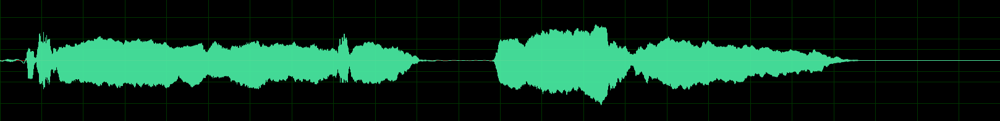
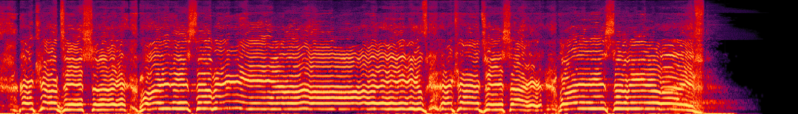
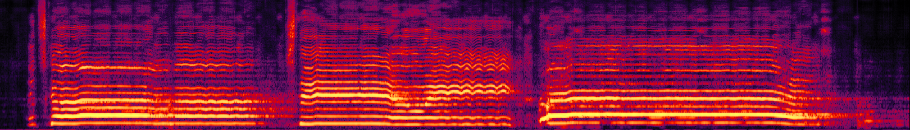
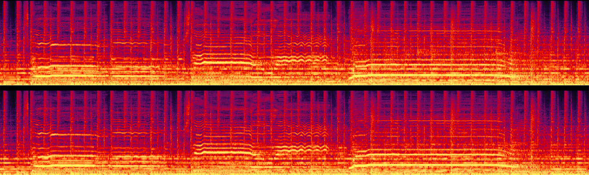
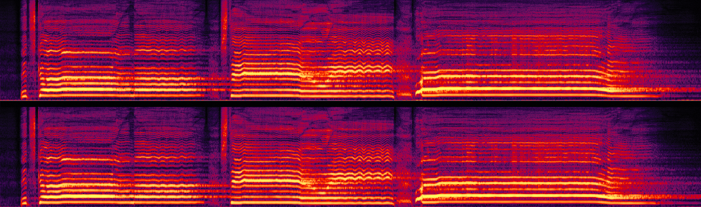

# Audio demo
For brevity, we only show the spectrograms and waveforms of the **right channel**. To see the complete binaural spectrograms and waveforms, please click on `Expand binaural images`.

<!-- <html> -->
<style>
  th, tr, td {border: none!important; vertical-align: middle; padding: 0px; margin: 0px auto;};
  img {padding: 0px; border: 0px; margin: 0px;}
</style>
  
## Case 1
<div align='center'>
<table style="margin: 0,auto; align:center; vertical-align:middle; border: none!important">
    <tr>
        <td align='center'> <b>Mixture</b> </td>
        <td> </td>
        <td> </td>
    </tr>
    <tr>
      <td align='middle'> <b>ResUNetDecouple+</b> </td>
        <td> </td>
        <td> </td>
    </tr>
    <tr>
        <td align='center'> <b>VocEmb4Sep (ResUNetDecouple+)</b> </td>
        <td> </td>
        <td> </td>
    </tr>
    <tr>
      <td align='center'> <b>HDemucs</b> </td>
        <td> </td>
        <td> </td>
    </tr>
    <tr>
      <td align='center'> <b>VocEmb4Sep (HDemucs)</b></td>
        <td> </td>
        <td> </td>
    </tr>
    <tr>
      <td align='center'> <b>Clean</b> </td>
        <td> </td>
        <td> </td>
    </tr>
</table>
  
<details align='right'>
  <summary>Expand binaural images</summary>
  
  <table style="margin-left: auto; margin-right: auto; align:center; border: none!important">
    <tr margin-bottom='0px'>
      <td align='center'> <b>Mixture</b> </td>
        <td> </td>
        <td> </td>
    </tr>
    <tr>
      <td align='center'> <b>ResUNetDecouple+</b> </td>
        <td> </td>
        <td> </td>
    </tr>
    <tr>
      <td align='center'> <b>VocEmb4Sep (ResUNetDecouple+)</b> </td>
        <td> </td>
        <td> </td>
    </tr>
    <tr>
      <td align='center'> <b>HDemucs</b> </td>
        <td> </td>
        <td> </td>
    </tr>
    <tr>
      <td align='center'> <b>VocEmb4Sep (HDemucs)</b></td>
        <td> </td>
        <td> </td>
    </tr>
    <tr>
      <td align='center'> <b>Clean</b> </td>
        <td> </td>
        <td> </td>
    </tr>
</table>
</details>
<br/>
<table style="margin-left: auto; margin-right: auto; align:center; border: none!important; width: 100%">
    <tr>
        <td align='center'>Mixture</td>
        <td align='center'>ResUNetDecouple+</td>
        <td align='center'>VocEmb4Sep (ResUNetDecouple+)</td>
    </tr>
    <tr>
    	<td align='center' width='30%'>
        <audio controls>
            <source src="./wav/Mix_Atrophy_01.wav" type="audio/wav">
            Your browser does not support the audio element.
        </audio>
        </td>
    	<td align='center' width='30%'>
        <audio controls>
            <source src="./wav/ResUNet_Atrophy_01.wav" type="audio/wav">
            Your browser does not support the audio element.
        </audio>
        </td>
    	<td align='center' width='30%'>
        <audio controls>
            <source src="./wav/preFro_Atrophy_01.wav" type="audio/wav">
            Your browser does not support the audio element.
        </audio>
        </td>
    </tr>
    <tr>
    <td align='center'>HDemucs</td>
    <td align='center'>VocEmb4Sep (HDemucs)</td>
    <td align='center'>Clean</td>
    </tr>
    <tr>
        <td align='center' width='30%'>
        <audio controls>
            <source src="./wav/HDemucs_Atrophy_01.wav" type="audio/wav">
            Your browser does not support the audio element.
        </audio>
        </td>
        <td align='center' width='30%'>
        <audio controls>
            <source src="./wav/HDemucsUpd2_Atrophy_01.wav" type="audio/wav">
            Your browser does not support the audio element.
        </audio>
        </td>
        <td align='center' width='30%'>
        <audio controls>
            <source src="./wav/clean_Atrophy_01.wav" type="audio/wav">
            Your browser does not support the audio element.
        </audio>
        </td>
    </tr>
  </table></div>
  
## Case 2  
<div align='center'>
<table style="margin: 0,auto; align:center; vertical-align:middle; border: none!important">
    <tr>
        <td align='center'> <b>Mixture</b> </td>
        <td> </td>
        <td> </td>
    </tr>
    <tr>
      <td align='middle'> <b>ResUNetDecouple+</b> </td>
        <td> </td>
        <td> </td>
    </tr>
    <tr>
        <td align='center'> <b>VocEmb4Sep (ResUNetDecouple+)</b> </td>
        <td> </td>
        <td> </td>
    </tr>
    <tr>
      <td align='center'> <b>HDemucs</b> </td>
        <td> </td>
        <td> </td>
    </tr>
    <tr>
      <td align='center'> <b>VocEmb4Sep (HDemucs)</b></td>
        <td> </td>
        <td> </td>
    </tr>
    <tr>
      <td align='center'> <b>Clean</b> </td>
        <td> </td>
        <td> </td>
    </tr>
</table>
  
<details align='right'>
  <summary>Expand binaural images</summary>
  
  <table style="margin-left: auto; margin-right: auto; align:center; border: none!important">
    <tr margin-bottom='0px'>
      <td align='center'> <b>Mixture</b> </td>
        <td> </td>
        <td> </td>
    </tr>
    <tr>
      <td align='center'> <b>ResUNetDecouple+</b> </td>
        <td> </td>
        <td> </td>
    </tr>
    <tr>
      <td align='center'> <b>VocEmb4Sep (ResUNetDecouple+)</b> </td>
        <td> </td>
        <td> </td>
    </tr>
    <tr>
      <td align='center'> <b>HDemucs</b> </td>
        <td> </td>
        <td> </td>
    </tr>
    <tr>
      <td align='center'> <b>VocEmb4Sep (HDemucs)</b></td>
        <td> </td>
        <td> </td>
    </tr>
    <tr>
      <td align='center'> <b>Clean</b> </td>
        <td> </td>
        <td> </td>
    </tr>
</table>
</details>
<br/>
<table style="margin-left: auto; margin-right: auto; align:center; border: none!important; width: 100%">
    <tr>
        <td align='center'>Mixture</td>
        <td align='center'>ResUNetDecouple+</td>
        <td align='center'>VocEmb4Sep (ResUNetDecouple+)</td>
    </tr>
    <tr>
    	<td align='center' width='30%'>
        <audio controls>
            <source src="./wav/Mix_Atrophy_02.wav" type="audio/wav">
            Your browser does not support the audio element.
        </audio>
        </td>
    	<td align='center' width='30%'>
        <audio controls>
            <source src="./wav/ResUNet_Atrophy_02.wav" type="audio/wav">
            Your browser does not support the audio element.
        </audio>
        </td>
    	<td align='center' width='30%'>
        <audio controls>
            <source src="./wav/preFro_Atrophy_02.wav" type="audio/wav">
            Your browser does not support the audio element.
        </audio>
        </td>
    </tr>
    <tr>
    <td align='center'>HDemucs</td>
    <td align='center'>VocEmb4Sep (HDemucs)</td>
    <td align='center'>Clean</td>
    </tr>
    <tr>
        <td align='center' width='30%'>
        <audio controls>
            <source src="./wav/HDemucs_Atrophy_02.wav" type="audio/wav">
            Your browser does not support the audio element.
        </audio>
        </td>
        <td align='center' width='30%'>
        <audio controls>
            <source src="./wav/HDemucsUpd2_Atrophy_02.wav" type="audio/wav">
            Your browser does not support the audio element.
        </audio>
        </td>
        <td align='center' width='30%'>
        <audio controls>
            <source src="./wav/clean_Atrophy_02.wav" type="audio/wav">
            Your browser does not support the audio element.
        </audio>
        </td>
    </tr>
  </table></div>

## Case 3
  <div align='center'>
<table style="margin: 0,auto; align:center; vertical-align:middle; border: none!important">
    <tr>
        <td align='center'> <b>Mixture</b> </td>
        <td> </td>
        <td> </td>
    </tr>
    <tr>
      <td align='middle'> <b>ResUNetDecouple+</b> </td>
        <td> </td>
        <td> </td>
    </tr>
    <tr>
        <td align='center'> <b>VocEmb4Sep (ResUNetDecouple+)</b> </td>
        <td> </td>
        <td> </td>
    </tr>
    <tr>
      <td align='center'> <b>HDemucs</b> </td>
        <td> </td>
        <td> </td>
    </tr>
    <tr>
      <td align='center'> <b>VocEmb4Sep (HDemucs)</b></td>
        <td> </td>
        <td> </td>
    </tr>
    <tr>
      <td align='center'> <b>Clean</b> </td>
        <td> </td>
        <td> </td>
    </tr>
</table>
  
<details align='right'>
  <summary>Expand binaural images</summary>
  
  <table style="margin-left: auto; margin-right: auto; align:center; border: none!important">
    <tr margin-bottom='0px'>
      <td align='center'> <b>Mixture</b> </td>
        <td> </td>
        <td> </td>
    </tr>
    <tr>
      <td align='center'> <b>ResUNetDecouple+</b> </td>
        <td> </td>
        <td> </td>
    </tr>
    <tr>
      <td align='center'> <b>VocEmb4Sep (ResUNetDecouple+)</b> </td>
        <td> </td>
        <td> </td>
    </tr>
    <tr>
      <td align='center'> <b>HDemucs</b> </td>
        <td> </td>
        <td> </td>
    </tr>
    <tr>
      <td align='center'> <b>VocEmb4Sep (HDemucs)</b></td>
        <td> </td>
        <td> </td>
    </tr>
    <tr>
      <td align='center'> <b>Clean</b> </td>
        <td> </td>
        <td> </td>
    </tr>
</table>
</details>
<br/>
<table style="margin-left: auto; margin-right: auto; align:center; border: none!important; width: 100%">
    <tr>
        <td align='center'>Mixture</td>
        <td align='center'>ResUNetDecouple+</td>
        <td align='center'>VocEmb4Sep (ResUNetDecouple+)</td>
    </tr>
    <tr>
    	<td align='center' width='30%'>
        <audio controls>
            <source src="./wav/Mix_Atrophy_03.wav" type="audio/wav">
            Your browser does not support the audio element.
        </audio>
        </td>
    	<td align='center' width='30%'>
        <audio controls>
            <source src="./wav/ResUNet_Atrophy_03.wav" type="audio/wav">
            Your browser does not support the audio element.
        </audio>
        </td>
    	<td align='center' width='30%'>
        <audio controls>
            <source src="./wav/preFro_Atrophy_03.wav" type="audio/wav">
            Your browser does not support the audio element.
        </audio>
        </td>
    </tr>
    <tr>
    <td align='center'>HDemucs</td>
    <td align='center'>VocEmb4Sep (HDemucs)</td>
    <td align='center'>Clean</td>
    </tr>
    <tr>
        <td align='center' width='30%'>
        <audio controls>
            <source src="./wav/HDemucs_Atrophy_03.wav" type="audio/wav">
            Your browser does not support the audio element.
        </audio>
        </td>
        <td align='center' width='30%'>
        <audio controls>
            <source src="./wav/HDemucsUpd2_Atrophy_03.wav" type="audio/wav">
            Your browser does not support the audio element.
        </audio>
        </td>
        <td align='center' width='30%'>
        <audio controls>
            <source src="./wav/clean_Atrophy_03.wav" type="audio/wav">
            Your browser does not support the audio element.
        </audio>
        </td>
    </tr>
    </table></div>

## Case 4
  <div align='center'>
<table style="margin: 0,auto; align:center; vertical-align:middle; border: none!important">
    <tr>
        <td align='center'> <b>Mixture</b> </td>
        <td> </td>
        <td> </td>
    </tr>
    <tr>
      <td align='middle'> <b>ResUNetDecouple+</b> </td>
        <td> </td>
        <td> </td>
    </tr>
    <tr>
        <td align='center'> <b>VocEmb4Sep (ResUNetDecouple+)</b> </td>
        <td> </td>
        <td> </td>
    </tr>
    <tr>
      <td align='center'> <b>HDemucs</b> </td>
        <td> </td>
        <td> </td>
    </tr>
    <tr>
      <td align='center'> <b>VocEmb4Sep (HDemucs)</b></td>
        <td> </td>
        <td> </td>
    </tr>
    <tr>
      <td align='center'> <b>Clean</b> </td>
        <td> </td>
        <td> </td>
    </tr>
</table>
  
<details align='right'>
  <summary>Expand binaural images</summary>
  
  <table style="margin-left: auto; margin-right: auto; align:center; border: none!important">
    <tr margin-bottom='0px'>
      <td align='center'> <b>Mixture</b> </td>
        <td> </td>
        <td> </td>
    </tr>
    <tr>
      <td align='center'> <b>ResUNetDecouple+</b> </td>
        <td> </td>
        <td> </td>
    </tr>
    <tr>
      <td align='center'> <b>VocEmb4Sep (ResUNetDecouple+)</b> </td>
        <td> </td>
        <td> </td>
    </tr>
    <tr>
      <td align='center'> <b>HDemucs</b> </td>
        <td> </td>
        <td> </td>
    </tr>
    <tr>
      <td align='center'> <b>VocEmb4Sep (HDemucs)</b></td>
        <td> </td>
        <td> </td>
    </tr>
    <tr>
      <td align='center'> <b>Clean</b> </td>
        <td> </td>
        <td> </td>
    </tr>
</table>
</details>
<br/>
<table style="margin-left: auto; margin-right: auto; align:center; border: none!important; width: 100%">
    <tr>
        <td align='center'>Mixture</td>
        <td align='center'>ResUNetDecouple+</td>
        <td align='center'>VocEmb4Sep (ResUNetDecouple+)</td>
    </tr>
    <tr>
    	<td align='center' width='30%'>
        <audio controls>
            <source src="./wav/Mix_Atrophy_01.wav" type="audio/wav">
            Your browser does not support the audio element.
        </audio>
        </td>
    	<td align='center' width='30%'>
        <audio controls>
            <source src="./wav/ResUNet_Atrophy_01.wav" type="audio/wav">
            Your browser does not support the audio element.
        </audio>
        </td>
    	<td align='center' width='30%'>
        <audio controls>
            <source src="./wav/preFro_Atrophy_01.wav" type="audio/wav">
            Your browser does not support the audio element.
        </audio>
        </td>
    </tr>
    <tr>
    <td align='center'>HDemucs</td>
    <td align='center'>VocEmb4Sep (HDemucs)</td>
    <td align='center'>Clean</td>
    </tr>
    <tr>
        <td align='center' width='30%'>
        <audio controls>
            <source src="./wav/HDemucs_Atrophy_01.wav" type="audio/wav">
            Your browser does not support the audio element.
        </audio>
        </td>
        <td align='center' width='30%'>
        <audio controls>
            <source src="./wav/HDemucsUpd2_Atrophy_01.wav" type="audio/wav">
            Your browser does not support the audio element.
        </audio>
        </td>
        <td align='center' width='30%'>
        <audio controls>
            <source src="./wav/clean_Atrophy_01.wav" type="audio/wav">
            Your browser does not support the audio element.
        </audio>
        </td>
    </tr>
    </table></div>
  
## Case 5
  <div align='center'>
<table style="margin: 0,auto; align:center; vertical-align:middle; border: none!important">
    <tr>
        <td align='center'> <b>Mixture</b> </td>
        <td> </td>
        <td> </td>
    </tr>
    <tr>
      <td align='middle'> <b>ResUNetDecouple+</b> </td>
        <td> </td>
        <td> </td>
    </tr>
    <tr>
        <td align='center'> <b>VocEmb4Sep (ResUNetDecouple+)</b> </td>
        <td> </td>
        <td> </td>
    </tr>
    <tr>
      <td align='center'> <b>HDemucs</b> </td>
        <td> </td>
        <td> </td>
    </tr>
    <tr>
      <td align='center'> <b>VocEmb4Sep (HDemucs)</b></td>
        <td> </td>
        <td> </td>
    </tr>
    <tr>
      <td align='center'> <b>Clean</b> </td>
        <td> </td>
        <td> </td>
    </tr>
</table>
  
<details align='right'>
  <summary>Expand binaural images</summary>
  
  <table style="margin-left: auto; margin-right: auto; align:center; border: none!important">
    <tr margin-bottom='0px'>
      <td align='center'> <b>Mixture</b> </td>
        <td> </td>
        <td> </td>
    </tr>
    <tr>
      <td align='center'> <b>ResUNetDecouple+</b> </td>
        <td> </td>
        <td> </td>
    </tr>
    <tr>
      <td align='center'> <b>VocEmb4Sep (ResUNetDecouple+)</b> </td>
        <td> </td>
        <td> </td>
    </tr>
    <tr>
      <td align='center'> <b>HDemucs</b> </td>
        <td> </td>
        <td> </td>
    </tr>
    <tr>
      <td align='center'> <b>VocEmb4Sep (HDemucs)</b></td>
        <td> </td>
        <td> </td>
    </tr>
    <tr>
      <td align='center'> <b>Clean</b> </td>
        <td> </td>
        <td> </td>
    </tr>
</table>
</details>
<br/>
<table style="margin-left: auto; margin-right: auto; align:center; border: none!important; width: 100%">
    <tr>
        <td align='center'>Mixture</td>
        <td align='center'>ResUNetDecouple+</td>
        <td align='center'>VocEmb4Sep (ResUNetDecouple+)</td>
    </tr>
    <tr>
    	<td align='center' width='30%'>
        <audio controls>
            <source src="./wav/Mix_Atrophy_01.wav" type="audio/wav">
            Your browser does not support the audio element.
        </audio>
        </td>
    	<td align='center' width='30%'>
        <audio controls>
            <source src="./wav/ResUNet_Atrophy_01.wav" type="audio/wav">
            Your browser does not support the audio element.
        </audio>
        </td>
    	<td align='center' width='30%'>
        <audio controls>
            <source src="./wav/preFro_Atrophy_01.wav" type="audio/wav">
            Your browser does not support the audio element.
        </audio>
        </td>
    </tr>
    <tr>
    <td align='center'>HDemucs</td>
    <td align='center'>VocEmb4Sep (HDemucs)</td>
    <td align='center'>Clean</td>
    </tr>
    <tr>
        <td align='center' width='30%'>
        <audio controls>
            <source src="./wav/HDemucs_Atrophy_01.wav" type="audio/wav">
            Your browser does not support the audio element.
        </audio>
        </td>
        <td align='center' width='30%'>
        <audio controls>
            <source src="./wav/HDemucsUpd2_Atrophy_01.wav" type="audio/wav">
            Your browser does not support the audio element.
        </audio>
        </td>
        <td align='center' width='30%'>
        <audio controls>
            <source src="./wav/clean_Atrophy_01.wav" type="audio/wav">
            Your browser does not support the audio element.
        </audio>
        </td>
    </tr>
    </table></div>
  
## Case 6
  <div align='center'>
<table style="margin: 0,auto; align:center; vertical-align:middle; border: none!important">
    <tr>
        <td align='center'> <b>Mixture</b> </td>
        <td> </td>
        <td> </td>
    </tr>
    <tr>
      <td align='middle'> <b>ResUNetDecouple+</b> </td>
        <td> </td>
        <td> </td>
    </tr>
    <tr>
        <td align='center'> <b>VocEmb4Sep (ResUNetDecouple+)</b> </td>
        <td> </td>
        <td> </td>
    </tr>
    <tr>
      <td align='center'> <b>HDemucs</b> </td>
        <td> </td>
        <td> </td>
    </tr>
    <tr>
      <td align='center'> <b>VocEmb4Sep (HDemucs)</b></td>
        <td> </td>
        <td> </td>
    </tr>
    <tr>
      <td align='center'> <b>Clean</b> </td>
        <td> </td>
        <td> </td>
    </tr>
</table>
  
<details align='right'>
  <summary>Expand binaural images</summary>
  
  <table style="margin-left: auto; margin-right: auto; align:center; border: none!important">
    <tr margin-bottom='0px'>
      <td align='center'> <b>Mixture</b> </td>
        <td> </td>
        <td> </td>
    </tr>
    <tr>
      <td align='center'> <b>ResUNetDecouple+</b> </td>
        <td> </td>
        <td> </td>
    </tr>
    <tr>
      <td align='center'> <b>VocEmb4Sep (ResUNetDecouple+)</b> </td>
        <td> </td>
        <td> </td>
    </tr>
    <tr>
      <td align='center'> <b>HDemucs</b> </td>
        <td> </td>
        <td> </td>
    </tr>
    <tr>
      <td align='center'> <b>VocEmb4Sep (HDemucs)</b></td>
        <td> </td>
        <td> </td>
    </tr>
    <tr>
      <td align='center'> <b>Clean</b> </td>
        <td> </td>
        <td> </td>
    </tr>
</table>
</details>
<br/>
<table style="margin-left: auto; margin-right: auto; align:center; border: none!important; width: 100%">
    <tr>
        <td align='center'>Mixture</td>
        <td align='center'>ResUNetDecouple+</td>
        <td align='center'>VocEmb4Sep (ResUNetDecouple+)</td>
    </tr>
    <tr>
    	<td align='center' width='30%'>
        <audio controls>
            <source src="./wav/Mix_Atrophy_01.wav" type="audio/wav">
            Your browser does not support the audio element.
        </audio>
        </td>
    	<td align='center' width='30%'>
        <audio controls>
            <source src="./wav/ResUNet_Atrophy_01.wav" type="audio/wav">
            Your browser does not support the audio element.
        </audio>
        </td>
    	<td align='center' width='30%'>
        <audio controls>
            <source src="./wav/preFro_Atrophy_01.wav" type="audio/wav">
            Your browser does not support the audio element.
        </audio>
        </td>
    </tr>
    <tr>
    <td align='center'>HDemucs</td>
    <td align='center'>VocEmb4Sep (HDemucs)</td>
    <td align='center'>Clean</td>
    </tr>
    <tr>
        <td align='center' width='30%'>
        <audio controls>
            <source src="./wav/HDemucs_Atrophy_01.wav" type="audio/wav">
            Your browser does not support the audio element.
        </audio>
        </td>
        <td align='center' width='30%'>
        <audio controls>
            <source src="./wav/HDemucsUpd2_Atrophy_01.wav" type="audio/wav">
            Your browser does not support the audio element.
        </audio>
        </td>
        <td align='center' width='30%'>
        <audio controls>
            <source src="./wav/clean_Atrophy_01.wav" type="audio/wav">
            Your browser does not support the audio element.
        </audio>
        </td>
    </tr>
    </table></div>

  
  
<!-- </html> -->

### Small image


### Large image


### Definition lists can be used with HTML syntax.

<dl>
<dt>Name</dt>
<dd>Godzilla</dd>
<dt>Born</dt>
<dd>1952</dd>
<dt>Birthplace</dt>
<dd>Japan</dd>
<dt>Color</dt>
<dd>Green</dd>
</dl>

```
Long, single-line code blocks should not wrap. They should horizontally scroll if they are too long. This line should be long enough to demonstrate this.
```

```
The final element.
```
 -->
