<!-- ---
layout: default
---
 -->

# VocEmb4Sep: Boosting the Performance of Singing Voice Separation by Vocal Embeddings
### _Chenyi Li, Yi Li, Xuhao Du, Zhiyong Wu_

### Abstract
> Deep learning based methods have shown improved performance on singing voice separation (SVS). Most separation systems only pay attention to the separated sources while a few systems would consider auxiliary information. Aiming to separate cleaner vocals from the mixed music, we propose VocEmb4Sep to utilize vocal feature embeddings as auxiliary knowledge to condition the separation system and explore various ways to enhance the regulation effect of the embeddings on the SVS system. In this paper, firstly, a vocal feature encoder is trained to extract fine-grained vocal feature embeddings from pre-separated vocals. Secondly, an adaptation block is developed to integrate the embeddings into various separation networks. Finally, efficient training strategies are proposed to boost the conditional performance of the embeddings to the separation system. The experimental results demonstrate that our best strategy outperforms other separation systems on the MUSDB18 dataset with an SDR of 9.56 dB on vocals, establishing a new state-of-the-art for the separation of vocals.

---

## Introduction of the demo
Since we aim at reducing the distortion of vocals and interference of accompaniments, our demos demonstrate the improvement of _separator P_ applying **VocEmb4Sep** compared with the original _separator P_. In addition, we display the vocal extraction effects when there are sound effects in the music.  The demos of vocals separated by different methods classified according to their major effectiveness are listed below. These are some binaural music clips cut from [MUSDB18 dataset](https://sigsep.github.io/datasets/musdb.html#musdb18-compressed-stems). `VocEmb4Sep (Separator P)` means applying our proposed method **VocEmb4Sep** on _Separator P_ and `Reference` means the ground-truth vocals in the mixed music from the open datasets [MUSDB18 dataset](https://sigsep.github.io/datasets/musdb.html#musdb18-compressed-stems). 

> For brevity, we only show the spectrograms and waveforms of the **left channel**. To see the complete binaural spectrograms and waveforms, please click on `Expand binaural images`.

<!-- <html> -->
<!--  -->

## Reducing the distortion of separated vocals

### Case 1
  

<table style="margin: 0,auto; align:center; vertical-align:middle; border: none!important">
    <tr>
        <td align='center'> <b>Mixture</b> </td>
        <td> </td>
        <td> </td>
    </tr>
    <tr>
      <td align='middle'> <b>ResUNetDecouple+</b> </td>
        <td> </td>
        <td> </td>
    </tr>
    <tr>
        <td align='center'> <b>VocEmb4Sep (ResUNetDecouple+)</b> </td>
        <td> </td>
        <td> </td>
    </tr>
    <tr>
      <td align='center'> <b>HDemucs</b> </td>
        <td> </td>
        <td> </td>
    </tr>
    <tr>
      <td align='center'> <b>VocEmb4Sep (HDemucs)</b></td>
        <td> </td>
        <td> </td>
    </tr>
    <tr>
      <td align='center'> <b>Reference</b> </td>
        <td> </td>
        <td> </td>
    </tr>
</table>
  

  
Expand binaural images

  
  <table style="margin-left: auto; margin-right: auto; align:center; border: none!important">
    <tr margin-bottom='0px'>
      <td align='center'> <b>Mixture</b> </td>
        <td> </td>
        <td> </td>
    </tr>
    <tr>
      <td align='center'> <b>ResUNetDecouple+</b> </td>
        <td> </td>
        <td> </td>
    </tr>
    <tr>
      <td align='center'> <b>VocEmb4Sep (ResUNetDecouple+)</b> </td>
        <td> </td>
        <td> </td>
    </tr>
    <tr>
      <td align='center'> <b>HDemucs</b> </td>
        <td> </td>
        <td> </td>
    </tr>
    <tr>
      <td align='center'> <b>VocEmb4Sep (HDemucs)</b></td>
        <td> </td>
        <td> </td>
    </tr>
    <tr>
      <td align='center'> <b>Reference</b> </td>
        <td> </td>
        <td> </td>
    </tr>
</table>

 
 
<table style="margin-left: auto; margin-right: auto; align:center; border: none!important; width: 100%">
    <tr>
        <td align='center'>Mixture</td>
        <td align='center'>ResUNetDecouple+</td>
        <td align='center'>VocEmb4Sep (ResUNetDecouple+)</td>
    </tr>
    <tr>
    	<td align='center' width='30%'>
        <audio controls>
            <source src="./data/Mix_Shore_08.wav" type="audio/wav">
            Your browser does not support the audio element.
        </audio>
        </td>
    	<td align='center' width='30%'>
        <audio controls>
            <source src="./data/ResUNet_Shore_08.wav" type="audio/wav">
            Your browser does not support the audio element.
        </audio>
        </td>
    	<td align='center' width='30%'>
        <audio controls>
            <source src="./data/preFro_Shore_08.wav" type="audio/wav">
            Your browser does not support the audio element.
        </audio>
        </td>
    </tr>
    <tr>
    <td align='center'>Reference</td>
    <td align='center'>HDemucs</td>
    <td align='center'>VocEmb4Sep (HDemucs)</td>
    </tr>
    <tr>
        <td align='center' width='30%'>
        <audio controls>
            <source src="./data/clean_Shore_08.wav" type="audio/wav">
            Your browser does not support the audio element.
        </audio>
        </td>
        <td align='center' width='30%'>
        <audio controls>
            <source src="./data/HDemucs_Shore_08.wav" type="audio/wav">
            Your browser does not support the audio element.
        </audio>
        </td>
        <td align='center' width='30%'>
        <audio controls>
            <source src="./data/HDemucsUpd2_Shore_08.wav" type="audio/wav">
            Your browser does not support the audio element.
        </audio>
        </td>
    </tr>
    </table>

    

### Case 2
  

<table style="margin: 0,auto; align:center; vertical-align:middle; border: none!important">
    <tr>
        <td align='center'> <b>Mixture</b> </td>
        <td> </td>
        <td> </td>
    </tr>
    <tr>
      <td align='middle'> <b>ResUNetDecouple+</b> </td>
        <td> </td>
        <td> </td>
    </tr>
    <tr>
        <td align='center'> <b>VocEmb4Sep (ResUNetDecouple+)</b> </td>
        <td> </td>
        <td> </td>
    </tr>
    <tr>
      <td align='center'> <b>HDemucs</b> </td>
        <td> </td>
        <td> </td>
    </tr>
    <tr>
      <td align='center'> <b>VocEmb4Sep (HDemucs)</b></td>
        <td> </td>
        <td> </td>
    </tr>
    <tr>
      <td align='center'> <b>Reference</b> </td>
        <td> </td>
        <td> </td>
    </tr>
</table>
  

  
Expand binaural images

  
  <table style="margin-left: auto; margin-right: auto; align:center; border: none!important">
    <tr margin-bottom='0px'>
      <td align='center'> <b>Mixture</b> </td>
        <td> </td>
        <td> </td>
    </tr>
    <tr>
      <td align='center'> <b>ResUNetDecouple+</b> </td>
        <td> </td>
        <td> </td>
    </tr>
    <tr>
      <td align='center'> <b>VocEmb4Sep (ResUNetDecouple+)</b> </td>
        <td> </td>
        <td> </td>
    </tr>
    <tr>
      <td align='center'> <b>HDemucs</b> </td>
        <td> </td>
        <td> </td>
    </tr>
    <tr>
      <td align='center'> <b>VocEmb4Sep (HDemucs)</b></td>
        <td> </td>
        <td> </td>
    </tr>
    <tr>
      <td align='center'> <b>Reference</b> </td>
        <td> </td>
        <td> </td>
    </tr>
</table>

 
<table style="margin-left: auto; margin-right: auto; align:center; border: none!important; width: 100%">
    <tr>
        <td align='center'>Mixture</td>
        <td align='center'>ResUNetDecouple+</td>
        <td align='center'>VocEmb4Sep (ResUNetDecouple+)</td>
    </tr>
    <tr>
    	<td align='center' width='30%'>
        <audio controls>
            <source src="./data/Mix_Atrophy_03.wav" type="audio/wav">
            Your browser does not support the audio element.
        </audio>
        </td>
    	<td align='center' width='30%'>
        <audio controls>
            <source src="./data/ResUNet_Atrophy_03.wav" type="audio/wav">
            Your browser does not support the audio element.
        </audio>
        </td>
    	<td align='center' width='30%'>
        <audio controls>
            <source src="./data/preFro_Atrophy_03.wav" type="audio/wav">
            Your browser does not support the audio element.
        </audio>
        </td>
    </tr>
    <tr>
    <td align='center'>Reference</td>
    <td align='center'>HDemucs</td>
    <td align='center'>VocEmb4Sep (HDemucs)</td>
    </tr>
    <tr>
        <td align='center' width='30%'>
        <audio controls>
            <source src="./data/clean_Atrophy_03.wav" type="audio/wav">
            Your browser does not support the audio element.
        </audio>
        </td>
        <td align='center' width='30%'>
        <audio controls>
            <source src="./data/HDemucs_Atrophy_03.wav" type="audio/wav">
            Your browser does not support the audio element.
        </audio>
        </td>
        <td align='center' width='30%'>
        <audio controls>
            <source src="./data/HDemucsUpd2_Atrophy_03.wav" type="audio/wav">
            Your browser does not support the audio element.
        </audio>
        </td>
    </tr>
    </table>

    

## Reducing the interference of accompaniments

### Case 3

<table style="margin: 0,auto; align:center; vertical-align:middle; border: none!important">
    <tr>
        <td align='center'> <b>Mixture</b> </td>
        <td> </td>
        <td> </td>
    </tr>
    <tr>
      <td align='middle'> <b>ResUNetDecouple+</b> </td>
        <td> </td>
        <td> </td>
    </tr>
    <tr>
        <td align='center'> <b>VocEmb4Sep (ResUNetDecouple+)</b> </td>
        <td> </td>
        <td> </td>
    </tr>
    <tr>
      <td align='center'> <b>HDemucs</b> </td>
        <td> </td>
        <td> 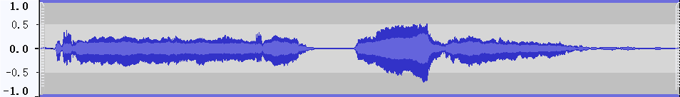</td>
    </tr>
    <tr>
      <td align='center'> <b>VocEmb4Sep (HDemucs)</b></td>
        <td> </td>
        <td> </td>
    </tr>
    <tr>
      <td align='center'> <b>Reference</b> </td>
        <td> </td>
        <td> </td>
    </tr>
 </table>
  

  
Expand binaural images

  
  <table style="margin-left: auto; margin-right: auto; align:center; border: none!important">
    <tr margin-bottom='0px'>
      <td align='center'> <b>Mixture</b> </td>
        <td> </td>
        <td> </td>
    </tr>
    <tr>
      <td align='center'> <b>ResUNetDecouple+</b> </td>
        <td> </td>
        <td> </td>
    </tr>
    <tr>
      <td align='center'> <b>VocEmb4Sep (ResUNetDecouple+)</b> </td>
        <td> </td>
        <td> </td>
    </tr>
    <tr>
      <td align='center'> <b>HDemucs</b> </td>
        <td> 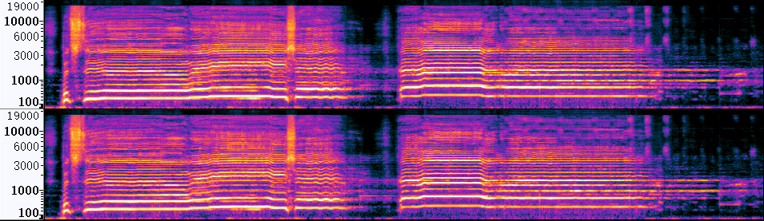</td>
        <td> </td>
    </tr>
    <tr>
      <td align='center'> <b>VocEmb4Sep (HDemucs)</b></td>
        <td> </td>
        <td> 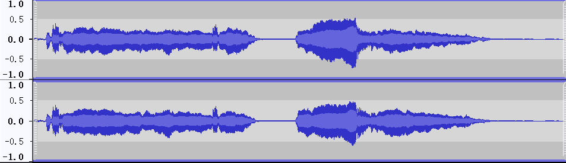</td>
    </tr>
    <tr>
      <td align='center'> <b>Reference</b> </td>
        <td> </td>
        <td> </td>
    </tr>
</table>

 
<table style="margin-left: auto; margin-right: auto; align:center; border: none!important; width: 100%">
    <tr>
        <td align='center'>Mixture</td>
        <td align='center'>ResUNetDecouple+</td>
        <td align='center'>VocEmb4Sep (ResUNetDecouple+)</td>
    </tr>
    <tr>
    	<td align='center' width='30%'>
        <audio controls>
            <source src="./data/Mix_Atrophy_01.wav" type="audio/wav">
            Your browser does not support the audio element.
        </audio>
        </td>
    	<td align='center' width='30%'>
        <audio controls>
            <source src="./data/ResUNet_Atrophy_01.wav" type="audio/wav">
            Your browser does not support the audio element.
        </audio>
        </td>
    	<td align='center' width='30%'>
        <audio controls>
            <source src="./data/preFro_Atrophy_01.wav" type="audio/wav">
            Your browser does not support the audio element.
        </audio>
        </td>
    </tr>
    <tr>
    <td align='center'>Reference</td>
    <td align='center'>HDemucs</td>
    <td align='center'>VocEmb4Sep (HDemucs)</td>
    </tr>
    <tr>
        <td align='center' width='30%'>
        <audio controls>
            <source src="./data/clean_Atrophy_01.wav" type="audio/wav">
            Your browser does not support the audio element.
        </audio>
        </td>
        <td align='center' width='30%'>
        <audio controls>
            <source src="./data/HDemucs_Atrophy_01.wav" type="audio/wav">
            Your browser does not support the audio element.
        </audio>
        </td>
        <td align='center' width='30%'>
        <audio controls>
            <source src="./data/HDemucsUpd2_Atrophy_01.wav" type="audio/wav">
            Your browser does not support the audio element.
        </audio>
        </td>
    </tr>
  </table>

  

### Case 4
  

<table style="margin: 0,auto; align:center; vertical-align:middle; border: none!important">
    <tr>
        <td align='center'> <b>Mixture</b> </td>
        <td> </td>
        <td> </td>
    </tr>
    <tr>
      <td align='middle'> <b>ResUNetDecouple+</b> </td>
        <td> </td>
        <td> </td>
    </tr>
    <tr>
        <td align='center'> <b>VocEmb4Sep (ResUNetDecouple+)</b> </td>
        <td> </td>
        <td> </td>
    </tr>
    <tr>
      <td align='center'> <b>HDemucs</b> </td>
        <td> </td>
        <td> </td>
    </tr>
    <tr>
      <td align='center'> <b>VocEmb4Sep (HDemucs)</b></td>
        <td> </td>
        <td> </td>
    </tr>
    <tr>
      <td align='center'> <b>Reference</b> </td>
        <td> </td>
        <td> </td>
    </tr>
</table>
  

  
Expand binaural images

  
  <table style="margin-left: auto; margin-right: auto; align:center; border: none!important">
    <tr margin-bottom='0px'>
      <td align='center'> <b>Mixture</b> </td>
        <td> </td>
        <td> </td>
    </tr>
    <tr>
      <td align='center'> <b>ResUNetDecouple+</b> </td>
        <td> </td>
        <td> 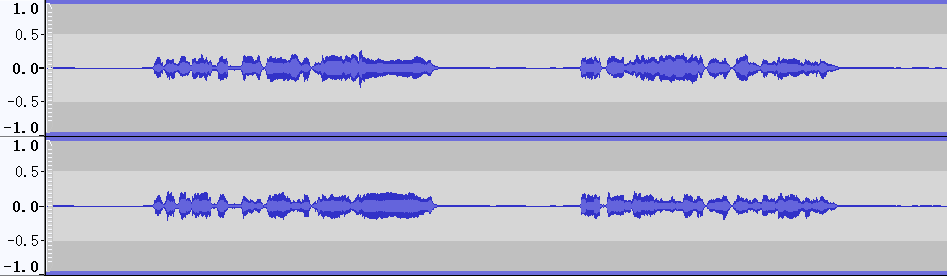</td>
    </tr>
    <tr>
      <td align='center'> <b>VocEmb4Sep (ResUNetDecouple+)</b> </td>
        <td> </td>
        <td> </td>
    </tr>
    <tr>
      <td align='center'> <b>HDemucs</b> </td>
        <td> </td>
        <td> </td>
    </tr>
    <tr>
      <td align='center'> <b>VocEmb4Sep (HDemucs)</b></td>
        <td> 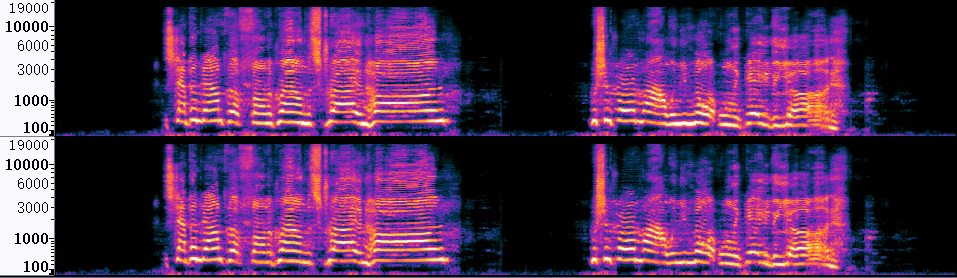</td>
        <td> </td>
    </tr>
    <tr>
      <td align='center'> <b>Reference</b> </td>
        <td> </td>
        <td> </td>
    </tr>
</table>

 
 
<table style="margin-left: auto; margin-right: auto; align:center; border: none!important; width: 100%">
    <tr>
        <td align='center'>Mixture</td>
        <td align='center'>ResUNetDecouple+</td>
        <td align='center'>VocEmb4Sep (ResUNetDecouple+)</td>
    </tr>
    <tr>
    	<td align='center' width='30%'>
        <audio controls>
            <source src="./data/Mix_Bulldozer_06.wav" type="audio/wav">
            Your browser does not support the audio element.
        </audio>
        </td>
    	<td align='center' width='30%'>
        <audio controls>
            <source src="./data/ResUNet_Bulldozer_06.wav" type="audio/wav">
            Your browser does not support the audio element.
        </audio>
        </td>
    	<td align='center' width='30%'>
        <audio controls>
            <source src="./data/preFro_Bulldozer_06.wav" type="audio/wav">
            Your browser does not support the audio element.
        </audio>
        </td>
    </tr>
    <tr>
    <td align='center'>Reference</td>
    <td align='center'>HDemucs</td>
    <td align='center'>VocEmb4Sep (HDemucs)</td>
    </tr>
    <tr>
        <td align='center' width='30%'>
        <audio controls>
            <source src="./data/clean_Bulldozer_06.wav" type="audio/wav">
            Your browser does not support the audio element.
        </audio>
        </td>
        <td align='center' width='30%'>
        <audio controls>
            <source src="./data/HDemucs_Bulldozer_06.wav" type="audio/wav">
            Your browser does not support the audio element.
        </audio>
        </td>
        <td align='center' width='30%'>
        <audio controls>
            <source src="./data/HDemucsUpd2_Bulldozer_06.wav" type="audio/wav">
            Your browser does not support the audio element.
        </audio>
        </td>
    </tr>
    </table>

 
### Case 5

  

<table style="margin: 0,auto; align:center; vertical-align:middle; border: none!important">
    <tr>
        <td align='center'> <b>Mixture</b> </td>
        <td> </td>
        <td> </td>
    </tr>
    <tr>
      <td align='middle'> <b>ResUNetDecouple+</b> </td>
        <td> </td>
        <td> </td>
    </tr>
    <tr>
        <td align='center'> <b>VocEmb4Sep (ResUNetDecouple+)</b> </td>
        <td> </td>
        <td> </td>
    </tr>
    <tr>
      <td align='center'> <b>HDemucs</b> </td>
        <td> </td>
        <td> </td>
    </tr>
    <tr>
      <td align='center'> <b>VocEmb4Sep (HDemucs)</b></td>
        <td> </td>
        <td> </td>
    </tr>
    <tr>
      <td align='center'> <b>Reference</b> </td>
        <td> </td>
        <td> </td>
    </tr>
</table>
  

  
Expand binaural images

  
  <table style="margin-left: auto; margin-right: auto; align:center; border: none!important">
    <tr margin-bottom='0px'>
      <td align='center'> <b>Mixture</b> </td>
        <td> </td>
        <td> </td>
    </tr>
    <tr>
      <td align='center'> <b>ResUNetDecouple+</b> </td>
        <td> </td>
        <td> </td>
    </tr>
    <tr>
      <td align='center'> <b>VocEmb4Sep (ResUNetDecouple+)</b> </td>
        <td> </td>
        <td> </td>
    </tr>
    <tr>
      <td align='center'> <b>HDemucs</b> </td>
        <td> </td>
        <td> </td>
    </tr>
    <tr>
      <td align='center'> <b>VocEmb4Sep (HDemucs)</b></td>
        <td> </td>
        <td> </td>
    </tr>
    <tr>
      <td align='center'> <b>Reference</b> </td>
        <td> </td>
        <td> </td>
    </tr>
</table>

 
 
<table style="margin-left: auto; margin-right: auto; align:center; border: none!important; width: 100%">
    <tr>
        <td align='center'>Mixture</td>
        <td align='center'>ResUNetDecouple+</td>
        <td align='center'>VocEmb4Sep (ResUNetDecouple+)</td>
    </tr>
    <tr>
    	<td align='center' width='30%'>
        <audio controls>
            <source src="./wav/Mix_Bulldozer_07.wav" type="audio/wav">
            Your browser does not support the audio element.
        </audio>
        </td>
    	<td align='center' width='30%'>
        <audio controls>
            <source src="./wav/ResUNet_Bulldozer_07.wav" type="audio/wav">
            Your browser does not support the audio element.
        </audio>
        </td>
    	<td align='center' width='30%'>
        <audio controls>
            <source src="./wav/preFro_Bulldozer_07.wav" type="audio/wav">
            Your browser does not support the audio element.
        </audio>
        </td>
    </tr>
    <tr>
    <td align='center'>Reference</td>
    <td align='center'>HDemucs</td>
    <td align='center'>VocEmb4Sep (HDemucs)</td>
    </tr>
    <tr>
        <td align='center' width='30%'>
        <audio controls>
            <source src="./wav/clean_Bulldozer_07.wav" type="audio/wav">
            Your browser does not support the audio element.
        </audio>
        </td>
        <td align='center' width='30%'>
        <audio controls>
            <source src="./wav/HDemucs_Bulldozer_07.wav" type="audio/wav">
            Your browser does not support the audio element.
        </audio>
        </td>
        <td align='center' width='30%'>
        <audio controls>
            <source src="./wav/HDemucsUpd2_Bulldozer_07.wav" type="audio/wav">
            Your browser does not support the audio element.
        </audio>
        </td>
    </tr>
    </table>

### Case 6

<table style="margin: 0,auto; align:center; vertical-align:middle; border: none!important">
    <tr>
        <td align='center'> <b>Mixture</b> </td>
        <td> </td>
        <td> </td>
    </tr>
    <tr>
      <td align='middle'> <b>ResUNetDecouple+</b> </td>
        <td> </td>
        <td> </td>
    </tr>
    <tr>
        <td align='center'> <b>VocEmb4Sep (ResUNetDecouple+)</b> </td>
        <td> </td>
        <td> </td>
    </tr>
    <tr>
      <td align='center'> <b>HDemucs</b> </td>
        <td> </td>
        <td> </td>
    </tr>
    <tr>
      <td align='center'> <b>VocEmb4Sep (HDemucs)</b></td>
        <td> </td>
        <td> </td>
    </tr>
    <tr>
      <td align='center'> <b>Reference</b> </td>
        <td> </td>
        <td> </td>
    </tr>
 </table>
  

  
Expand binaural images

  
  <table style="margin-left: auto; margin-right: auto; align:center; border: none!important">
    <tr margin-bottom='0px'>
      <td align='center'> <b>Mixture</b> </td>
        <td> </td>
        <td> </td>
    </tr>
    <tr>
      <td align='center'> <b>ResUNetDecouple+</b> </td>
        <td> </td>
        <td> </td>
    </tr>
    <tr>
      <td align='center'> <b>VocEmb4Sep (ResUNetDecouple+)</b> </td>
        <td> </td>
        <td> </td>
    </tr>
    <tr>
      <td align='center'> <b>HDemucs</b> </td>
        <td> </td>
        <td> </td>
    </tr>
    <tr>
      <td align='center'> <b>VocEmb4Sep (HDemucs)</b></td>
        <td> 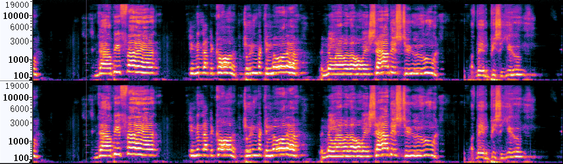</td>
        <td> </td>
    </tr>
    <tr>
      <td align='center'> <b>Reference</b> </td>
        <td> </td>
        <td> </td>
    </tr>
</table>

 
<table style="margin-left: auto; margin-right: auto; align:center; border: none!important; width: 100%">
    <tr>
        <td align='center'>Mixture</td>
        <td align='center'>ResUNetDecouple+</td>
        <td align='center'>VocEmb4Sep (ResUNetDecouple+)</td>
    </tr>
    <tr>
    	<td align='center' width='30%'>
        <audio controls>
            <source src="./data/mix_Angels_02.wav" type="audio/wav">
            Your browser does not support the audio element.
        </audio>
        </td>
    	<td align='center' width='30%'>
        <audio controls>
            <source src="./data/ResUNet_Angels_02.wav" type="audio/wav">
            Your browser does not support the audio element.
        </audio>
        </td>
    	<td align='center' width='30%'>
        <audio controls>
            <source src="./data/preFro_Angels_02.wav" type="audio/wav">
            Your browser does not support the audio element.
        </audio>
        </td>
    </tr>
    <tr>
    <td align='center'>Reference</td>
    <td align='center'>HDemucs</td>
    <td align='center'>VocEmb4Sep (HDemucs)</td>
    </tr>
    <tr>        
        <td align='center' width='30%'>
        <audio controls>
            <source src="./data/clean_Angels_02.wav" type="audio/wav">
            Your browser does not support the audio element.
        </audio>
        </td>
        <td align='center' width='30%'>
        <audio controls>
            <source src="./data/HDemucs_Angels_02.wav" type="audio/wav">
            Your browser does not support the audio element.
        </audio>
        </td>
        <td align='center' width='30%'>
        <audio controls>
            <source src="./data/HDemucsUpd_Angels_02.wav" type="audio/wav">
            Your browser does not support the audio element.
        </audio>
        </td>
    </tr>
  </table>
  
    
## Extract clean vocals from scenes with sound effects
In this part, we list music clips with sound effects. The results show that the separation systems can separate clean vocals with the sound effects reduced.

### Case 7
  

<table style="margin: 0,auto; align:center; vertical-align:middle; border: none!important">
    <tr>
        <td align='center'> <b>Mixture</b> </td>
        <td> </td>
        <td> </td>
    </tr>
    <tr>
      <td align='middle'> <b>ResUNetDecouple+</b> </td>
        <td> </td>
        <td> </td>
    </tr>
    <tr>
        <td align='center'> <b>VocEmb4Sep (ResUNetDecouple+)</b> </td>
        <td> </td>
        <td> </td>
    </tr>
    <tr>
      <td align='center'> <b>HDemucs</b> </td>
        <td> </td>
        <td> </td>
    </tr>
    <tr>
      <td align='center'> <b>VocEmb4Sep (HDemucs)</b></td>
        <td> </td>
        <td> </td>
    </tr>
    <tr>
      <td align='center'> <b>Reference</b> </td>
        <td> </td>
        <td> </td>
    </tr>
</table>
  

  
Expand binaural images

  
  <table style="margin-left: auto; margin-right: auto; align:center; border: none!important">
    <tr margin-bottom='0px'>
      <td align='center'> <b>Mixture</b> </td>
        <td> </td>
        <td> </td>
    </tr>
    <tr>
      <td align='center'> <b>ResUNetDecouple+</b> </td>
        <td> </td>
        <td> 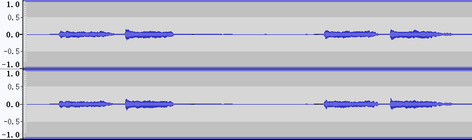</td>
    </tr>
    <tr>
      <td align='center'> <b>VocEmb4Sep (ResUNetDecouple+)</b> </td>
        <td> </td>
        <td> </td>
    </tr>
    <tr>
      <td align='center'> <b>HDemucs</b> </td>
        <td> 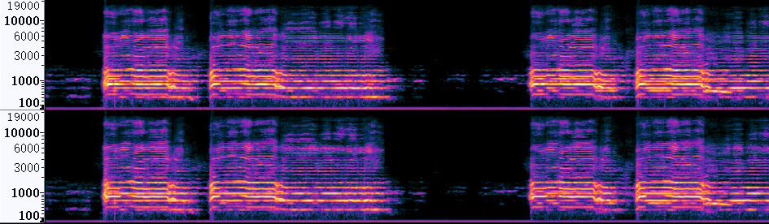</td>
        <td> </td>
    </tr>
    <tr>
      <td align='center'> <b>VocEmb4Sep (HDemucs)</b></td>
        <td> </td>
        <td> </td>
    </tr>
    <tr>
      <td align='center'> <b>Reference</b> </td>
        <td> </td>
        <td> </td>
    </tr>
</table>

 
 
<table style="margin-left: auto; margin-right: auto; align:center; border: none!important; width: 100%">
    <tr>
        <td align='center'>Mixture</td>
        <td align='center'>ResUNetDecouple+</td>
        <td align='center'>VocEmb4Sep (ResUNetDecouple+)</td>
    </tr>
    <tr>
    	<td align='center' width='30%'>
        <audio controls>
            <source src="./data/Mix_Actor_11.wav" type="audio/wav">
            Your browser does not support the audio element.
        </audio>
        </td>
    	<td align='center' width='30%'>
        <audio controls>
            <source src="./data/ResUNet_Actor_11.wav" type="audio/wav">
            Your browser does not support the audio element.
        </audio>
        </td>
    	<td align='center' width='30%'>
        <audio controls>
            <source src="./data/preFro_Actor_11.wav" type="audio/wav">
            Your browser does not support the audio element.
        </audio>
        </td>
    </tr>
    <tr>
    <td align='center'>Reference</td>
    <td align='center'>HDemucs</td>
    <td align='center'>VocEmb4Sep (HDemucs)</td>
    </tr>
    <tr>
        <td align='center' width='30%'>
        <audio controls>
            <source src="./data/clean_Actor_11.wav" type="audio/wav">
            Your browser does not support the audio element.
        </audio>
        </td>
        <td align='center' width='30%'>
        <audio controls>
            <source src="./data/HDemucs_Actor_11.wav" type="audio/wav">
            Your browser does not support the audio element.
        </audio>
        </td>
        <td align='center' width='30%'>
        <audio controls>
            <source src="./data/HDemucsUpd2_Actor_11.wav" type="audio/wav">
            Your browser does not support the audio element.
        </audio>
        </td>
    </tr>
    </table>

  
  
### Case 8
  

<table style="margin: 0,auto; align:center; vertical-align:middle; border: none!important">
    <tr>
        <td align='center'> <b>Mixture</b> </td>
        <td> 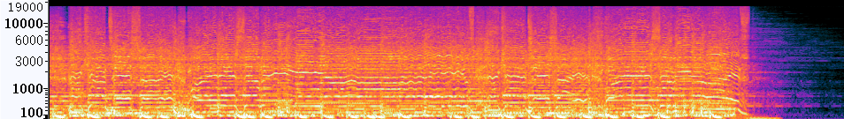</td>
        <td> 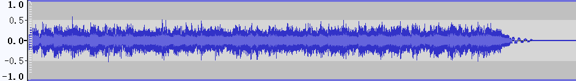</td>
    </tr>
    <tr>
      <td align='middle'> <b>ResUNetDecouple+</b> </td>
        <td> 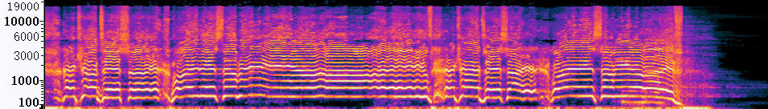</td>
        <td> 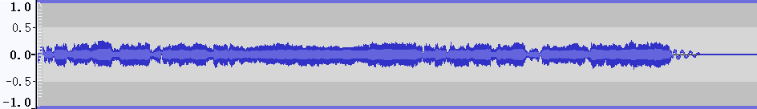</td>
    </tr>
    <tr>
        <td align='center'> <b>VocEmb4Sep (ResUNetDecouple+)</b> </td>
        <td> 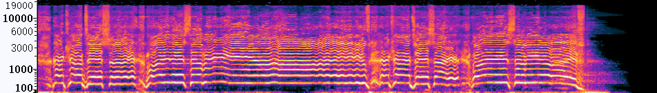</td>
        <td> 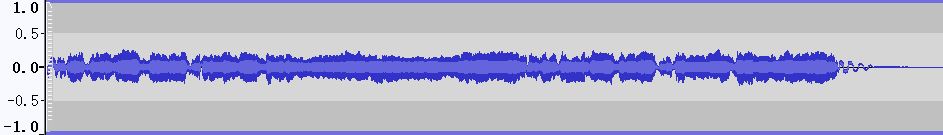</td>
    </tr>
    <tr>
      <td align='center'> <b>HDemucs</b> </td>
        <td> 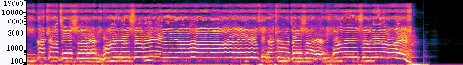</td>
        <td> 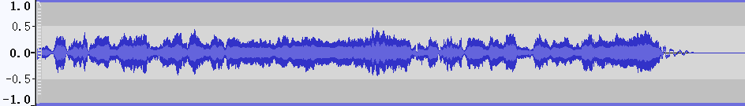</td>
    </tr>
    <tr>
      <td align='center'> <b>VocEmb4Sep (HDemucs)</b></td>
        <td> 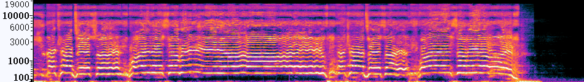</td>
        <td> 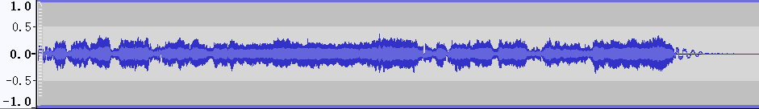</td>
    </tr>
    <tr>
      <td align='center'> <b>Reference</b> </td>
        <td> 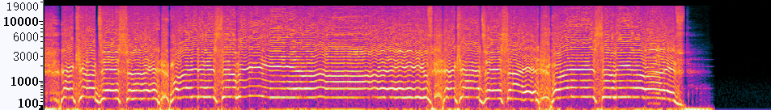</td>
        <td> 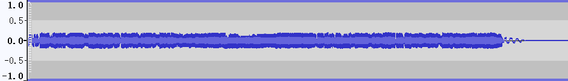</td>
    </tr>
</table>
  

  
Expand binaural images

  
  <table style="margin-left: auto; margin-right: auto; align:center; border: none!important">
    <tr margin-bottom='0px'>
      <td align='center'> <b>Mixture</b> </td>
        <td> 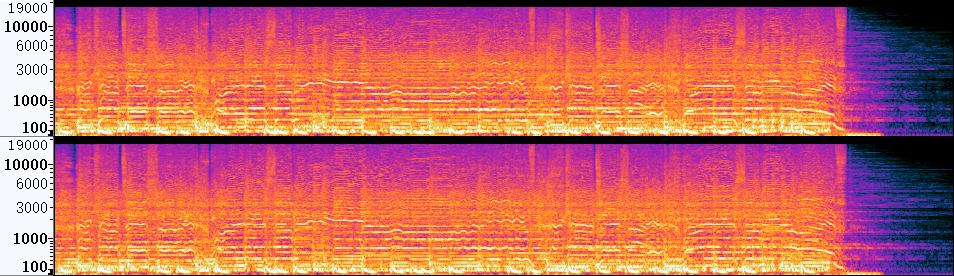</td>
        <td> 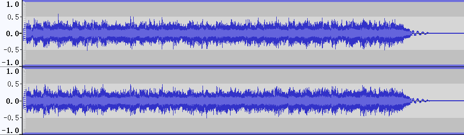</td>
    </tr>
    <tr>
      <td align='center'> <b>ResUNetDecouple+</b> </td>
        <td> 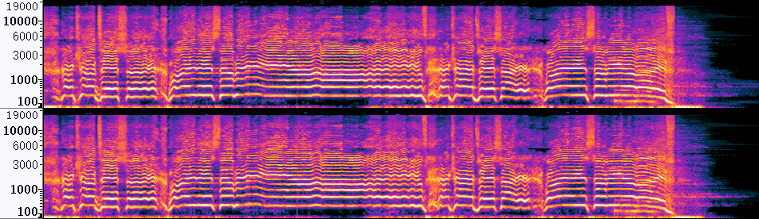</td>
        <td> </td>
    </tr>
    <tr>
      <td align='center'> <b>VocEmb4Sep (ResUNetDecouple+)</b> </td>
        <td> 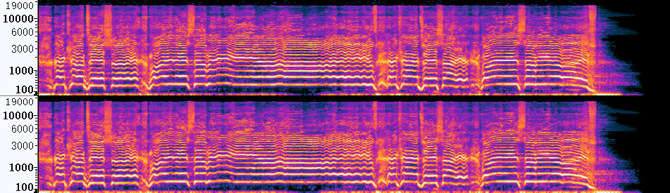</td>
        <td> 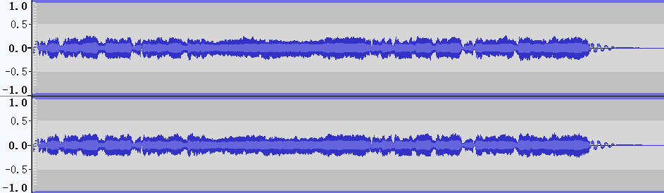</td>
    </tr>
    <tr>
      <td align='center'> <b>HDemucs</b> </td>
        <td> 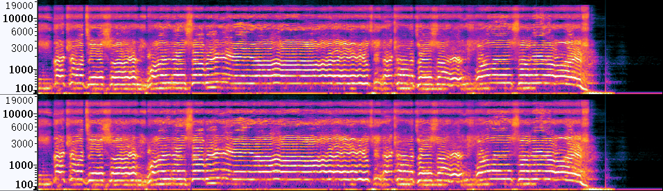</td>
        <td> 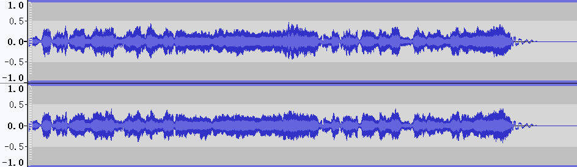</td>
    </tr>
    <tr>
      <td align='center'> <b>VocEmb4Sep (HDemucs)</b></td>
        <td> 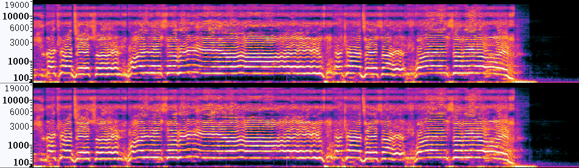</td>
        <td> 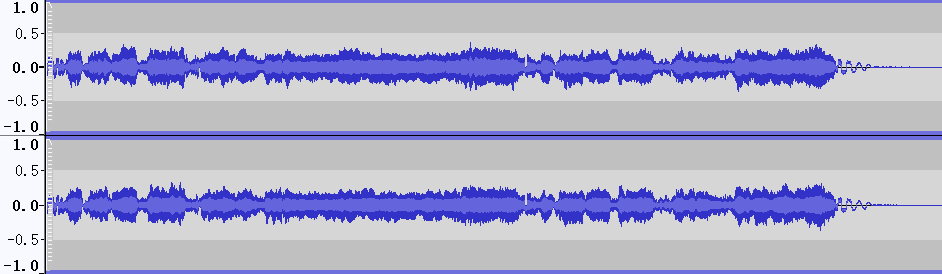</td>
    </tr>
    <tr>
      <td align='center'> <b>Reference</b> </td>
        <td> 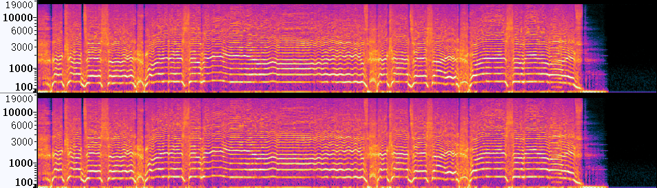</td>
        <td> 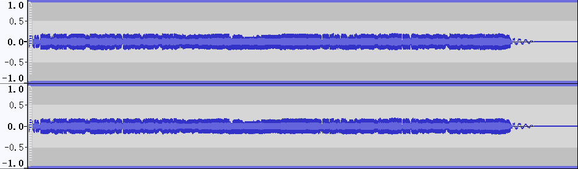</td>
    </tr>
</table>

 
<table style="margin-left: auto; margin-right: auto; align:center; border: none!important; width: 100%">
    <tr>
        <td align='center'>Mixture</td>
        <td align='center'>ResUNetDecouple+</td>
        <td align='center'>VocEmb4Sep (ResUNetDecouple+)</td>
    </tr>
    <tr>
    	<td align='center' width='30%'>
        <audio controls>
            <source src="./wav/Mix_Atrophy_02.wav" type="audio/wav">
            Your browser does not support the audio element.
        </audio>
        </td>
    	<td align='center' width='30%'>
        <audio controls>
            <source src="./wav/ResUNet_Atrophy_02.wav" type="audio/wav">
            Your browser does not support the audio element.
        </audio>
        </td>
    	<td align='center' width='30%'>
        <audio controls>
            <source src="./wav/preFro_Atrophy_02.wav" type="audio/wav">
            Your browser does not support the audio element.
        </audio>
        </td>
    </tr>
    <tr>
    <td align='center'>Reference</td>
    <td align='center'>HDemucs</td>
    <td align='center'>VocEmb4Sep (HDemucs)</td>
    </tr>
    <tr>
        <td align='center' width='30%'>
        <audio controls>
            <source src="./wav/clean_Atrophy_02.wav" type="audio/wav">
            Your browser does not support the audio element.
        </audio>
        </td>
        <td align='center' width='30%'>
        <audio controls>
            <source src="./wav/HDemucs_Atrophy_02.wav" type="audio/wav">
            Your browser does not support the audio element.
        </audio>
        </td>
        <td align='center' width='30%'>
        <audio controls>
            <source src="./wav/HDemucsUpd2_Atrophy_02.wav" type="audio/wav">
            Your browser does not support the audio element.
        </audio>
        </td>
    </tr>
    </table>

  
  
### Case 9
  

<table style="margin: 0,auto; align:center; vertical-align:middle; border: none!important">
    <tr>
        <td align='center'> <b>Mixture</b> </td>
        <td> </td>
        <td> 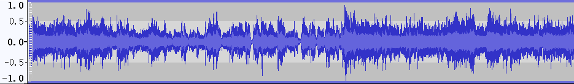</td>
    </tr>
    <tr>
      <td align='middle'> <b>ResUNetDecouple+</b> </td>
        <td> 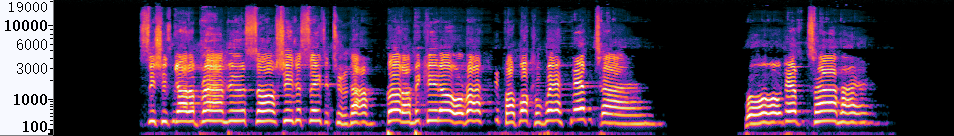</td>
        <td> 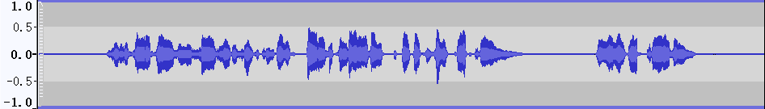</td>
    </tr>
    <tr>
        <td align='center'> <b>VocEmb4Sep (ResUNetDecouple+)</b> </td>
        <td> </td>
        <td> </td>
    </tr>
    <tr>
      <td align='center'> <b>HDemucs</b> </td>
        <td> </td>
        <td> </td>
    </tr>
    <tr>
      <td align='center'> <b>VocEmb4Sep (HDemucs)</b></td>
        <td> </td>
        <td> </td>
    </tr>
    <tr>
      <td align='center'> <b>Reference</b> </td>
        <td> </td>
        <td> </td>
    </tr>
</table>
  

  
Expand binaural images

  
  <table style="margin-left: auto; margin-right: auto; align:center; border: none!important">
    <tr margin-bottom='0px'>
      <td align='center'> <b>Mixture</b> </td>
        <td> </td>
        <td> </td>
    </tr>
    <tr>
      <td align='center'> <b>ResUNetDecouple+</b> </td>
        <td> 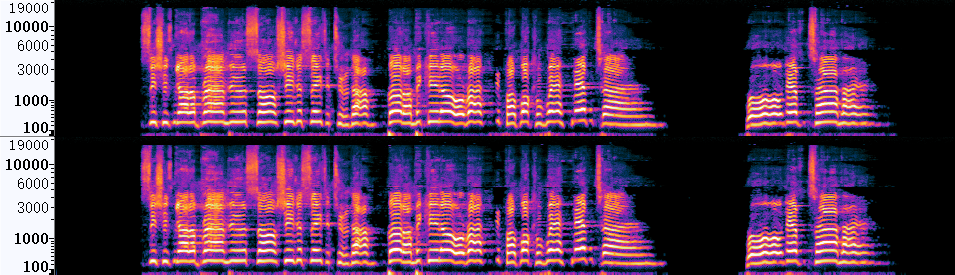</td>
        <td> 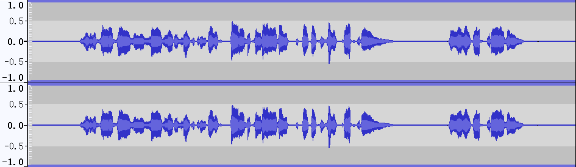</td>
    </tr>
    <tr>
      <td align='center'> <b>VocEmb4Sep (ResUNetDecouple+)</b> </td>
        <td> </td>
        <td> </td>
    </tr>
    <tr>
      <td align='center'> <b>HDemucs</b> </td>
        <td> 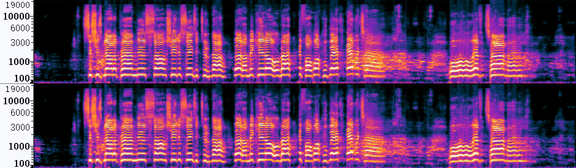</td>
        <td> </td>
    </tr>
    <tr>
      <td align='center'> <b>VocEmb4Sep (HDemucs)</b></td>
        <td> </td>
        <td> </td>
    </tr>
    <tr>
      <td align='center'> <b>Reference</b> </td>
        <td> </td>
        <td> </td>
    </tr>
</table>

 
<table style="margin-left: auto; margin-right: auto; align:center; border: none!important; width: 100%">
    <tr>
        <td align='center'>Mixture</td>
        <td align='center'>ResUNetDecouple+</td>
        <td align='center'>VocEmb4Sep (ResUNetDecouple+)</td>
    </tr>
    <tr>
    	<td align='center' width='30%'>
        <audio controls>
            <source src="./data/mix_Moos_05.wav" type="audio/wav">
            Your browser does not support the audio element.
        </audio>
        </td>
    	<td align='center' width='30%'>
        <audio controls>
            <source src="./data/ResUNet_Moos_05-1.wav" type="audio/wav">
            Your browser does not support the audio element.
        </audio>
        </td>
    	<td align='center' width='30%'>
        <audio controls>
            <source src="./data/preFro_Moos_05.wav" type="audio/wav">
            Your browser does not support the audio element.
        </audio>
        </td>
    </tr>
    <tr>
    <td align='center'>Reference</td>
    <td align='center'>HDemucs</td>
    <td align='center'>VocEmb4Sep (HDemucs)</td>
    </tr>
    <tr>
        <td align='center' width='30%'>
        <audio controls>
            <source src="./data/clean_Moos_05.wav" type="audio/wav">
            Your browser does not support the audio element.
        </audio>
        </td>
        <td align='center' width='30%'>
        <audio controls>
            <source src="./data/HDemucs_Moos_05.wav" type="audio/wav">
            Your browser does not support the audio element.
        </audio>
        </td>
        <td align='center' width='30%'>
        <audio controls>
            <source src="./data/HDemucsUpd_Moos_05.wav" type="audio/wav">
            Your browser does not support the audio element.
        </audio>
        </td>
    </tr>
    </table>

 

### Case 10
  

<table style="margin: 0,auto; align:center; vertical-align:middle; border: none!important">
    <tr>
        <td align='center'> <b>Mixture</b> </td>
        <td> </td>
        <td> </td>
    </tr>
    <tr>
      <td align='middle'> <b>ResUNetDecouple+</b> </td>
        <td> </td>
        <td> </td>
    </tr>
    <tr>
        <td align='center'> <b>VocEmb4Sep (ResUNetDecouple+)</b> </td>
        <td> </td>
        <td> </td>
    </tr>
    <tr>
      <td align='center'> <b>HDemucs</b> </td>
        <td> </td>
        <td> </td>
    </tr>
    <tr>
      <td align='center'> <b>VocEmb4Sep (HDemucs)</b></td>
        <td> </td>
        <td> </td>
    </tr>
    <tr>
      <td align='center'> <b>Reference</b> </td>
        <td> 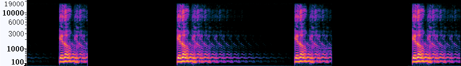</td>
        <td> </td>
    </tr>
</table>
  

  
Expand binaural images

  
  <table style="margin-left: auto; margin-right: auto; align:center; border: none!important">
    <tr margin-bottom='0px'>
      <td align='center'> <b>Mixture</b> </td>
        <td> 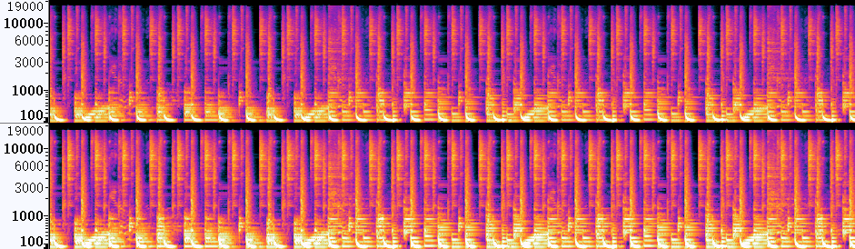</td>
        <td> </td>
    </tr>
    <tr>
      <td align='center'> <b>ResUNetDecouple+</b> </td>
        <td> </td>
        <td> </td>
    </tr>
    <tr>
      <td align='center'> <b>VocEmb4Sep (ResUNetDecouple+)</b> </td>
        <td> </td>
        <td> </td>
    </tr>
    <tr>
      <td align='center'> <b>HDemucs</b> </td>
        <td> </td>
        <td> </td>
    </tr>
    <tr>
      <td align='center'> <b>VocEmb4Sep (HDemucs)</b></td>
        <td> </td>
        <td> </td>
    </tr>
    <tr>
      <td align='center'> <b>Reference</b> </td>
        <td> 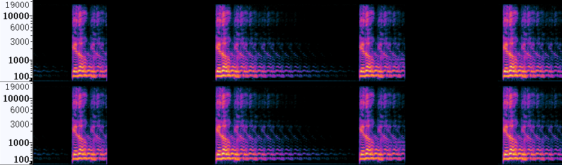</td>
        <td> </td>
    </tr>
</table>

 
<table style="margin-left: auto; margin-right: auto; align:center; border: none!important; width: 100%">
    <tr>
        <td align='center'>Mixture</td>
        <td align='center'>ResUNetDecouple+</td>
        <td align='center'>VocEmb4Sep (ResUNetDecouple+)</td>
    </tr>
    <tr>
    	<td align='center' width='30%'>
        <audio controls>
            <source src="./data/mix_OHNO_04.wav" type="audio/wav">
            Your browser does not support the audio element.
        </audio>
        </td>
    	<td align='center' width='30%'>
        <audio controls>
            <source src="./data/ResUNet_OHNO_04.wav" type="audio/wav">
            Your browser does not support the audio element.
        </audio>
        </td>
    	<td align='center' width='30%'>
        <audio controls>
            <source src="./data/preFro_OHNO_04.wav" type="audio/wav">
            Your browser does not support the audio element.
        </audio>
        </td>
    </tr>
    <tr>
    <td align='center'>Reference</td>
    <td align='center'>HDemucs</td>
    <td align='center'>VocEmb4Sep (HDemucs)</td>
    </tr>
    <tr>
        <td align='center' width='30%'>
        <audio controls>
            <source src="./data/clean_OHNO_04.wav" type="audio/wav">
            Your browser does not support the audio element.
        </audio>
        </td>
        <td align='center' width='30%'>
        <audio controls>
            <source src="./data/HDemucs_OHNO_04.wav" type="audio/wav">
            Your browser does not support the audio element.
        </audio>
        </td>
        <td align='center' width='30%'>
        <audio controls>
            <source src="./data/HDemucsUpd_OHNO_04.wav" type="audio/wav">
            Your browser does not support the audio element.
        </audio>
        </td>
    </tr>
    </table>

  
